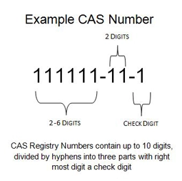

# 如何描述一个化学物质

描述/表达一个化学物质的方法有：

1. 化学名称：根据常见化合名称和有机化合物命名规则
2. 化学物质编码
3. 化学结构式：可视化、图片文件格式
4. 特定格式的化学体系结构文件：如CDXML格式，CDX格式，cml格式，MOL格式，SKC格式，是化学结构式的存储形式
5. 定义一些规则，使用文本格式、线性记法表示化学结构：为了在文本中快速存储与表达结构式，比如在数据库文本字段中存储，在简单文本中传递化学物质结构。例如SMILES、InChI

## 化学物质编码

### CAS

- 美国化学会的下设组织：美国化学文摘社（Chemical Abstract Service，CAS）。负责为每一种出现在文献中的物质分配一个CAS号，其目的是为了避免化学物质有多种名称的麻烦，使数据库的检索更为方便。如今几乎所有的化学数据库都支持CAS号检索。
- CAS号（CAS Registry Number或称CAS Number，CAS Rn，CAS \#），又称CAS登记号，是某种物质（化合物、高分子材料、生物序列（Biologicalsequences）、混合物或合金）的**唯一的数字识别号码**。该号是用来判定检索有多个名称的化学物质信息的重要工具。编号由3部分数字组成，各部分之间由短线联接。第一部分有2到7位数字，第二部分有2位数字，第三部分有1位数字作为校验码。
- 

### UN号

联合国（United Nations）编号（联合国危险货物运输专家委员会编号），也称作危险品运输编号，是联合国危险货物运输专家委员会对危险物质制定的编号。UN编号登录在联合国《关于危险货物运输的建议书》（Recommendations on the Transport of Dangerous Goods）中。

### EINECS登录号（又称EC编号）

欧洲经济共同体(European Community)的《欧洲现有商业化学品目录》(European Inventory of Existing commercial Chemical Substances)中对该化学品的登录编号。

### ELINCS登录号

《欧洲已申报化学品目录》(European List of Notified Chemical Substances)的登录编号，由欧盟化学品管理署（ECHA）及欧盟各成员国发布并管理，共收录物质5292种。

### ICSC编号

国际化学品安全卡International Chemical Safety Card，是由世界卫生组织(WHO)、国际劳工组织(ILO)和联合国环境规划署(UNEP)三个组织的合作机构--国际化学品安全规划署(IPCS)与欧洲联盟委员会(CEU)合作编辑的一套化学品安全信息卡片。国际化学品安全卡ICSC(International Chemical Safety Cards) 共设有化学品标识、危害/接触类型、急性危害/症状、预防、急救/消防、溢漏处置、包装与标志、应急响应、储存、重要数据、物理性质、环境数据、注解和附加资料14个项目。

### RTECS号

化学物质毒性作用登记号Registry of Toxic Effects of Chemical Substances，是美国职业安全与卫生研究所规定的登记号，可用来查找一种化学物质的毒理学数据。RTECS中主要包括以下六大类化学物质的毒性数据：直接刺激性（Primary irritation）、致突变性（Mutagenic effects）、对生殖的影响（Reproductive effects，即致畸性）、致肿瘤性（Tumorigenic effects）、急性毒性（Acute toxicity）、其他多剂量毒性。其中记录有该化学物质的数值毒性值，如半数致死量（LD50或LC50），最低中毒剂量（TDLo），最低中毒浓度（TCLo）等，以及实验所使用的物种和给药途径。

### 其它

- IMDG：International Maritime Dangerous Goods（国际海运危险货物）
- **危险货物编号**：CN号，China DG Number，DG即DangerousGoods，《GB12268-90危险货物品名表》的危险货物编号
- HS编码即海关编码：《商品名称及编码协调制度的国际公约》（International Convention for Harmonized Commodity Deionand Coding System）简称协调制度
- MDL号是每一种化学反应和变化的唯一识别号
- [化合物的编码 (qq.com)](https://mp.weixin.qq.com/s?__biz=MzIyNzM4Njk5OA==&mid=2247515737&idx=3&sn=a2316c16c34605fb53900b1e14b2a03a&chksm=e8630d40df148456199ea9bd5c93fc50f26560b342810be723b0819fa06e265b4fab7f382722&scene=27)

## 化学体系结构文件

### 格式

- **以文件后缀表示/区分**
- 大部分小分子结构可以从Pubchem或Chemspider等数据库里面下载sdf或者pdb格式的2D/3D结构文件，大分子结构可以从PDB数据库下载pdb
- 新合成的化合物没有收录进数据库，可以使用Chemdraw进行绘制，通过经典化学构图方法对小分子化合物进行结构构建后，采用量化软件(Gaussian，ORCA等)计算分子电荷分布、分子轨道和反应活化能等对小分子进行结构优化
- 小分子常用sdf、mol2；大分子常用pdb

### pdb

- 来自PDB(Protein Data Bank)，是一种标准文件格式, 其中包含原子的坐标等信息, 提交给 Protein Data Bank at the Research Collaboratory for Structural Bioinformatics (RCSB) 的结构都使用这种标准格式.
- 常用于蛋白质结构，但可以用于其他类型的分子
- 完整的PDB文件提供了非常多的信息, 包括作者, 参考文献以及结构说明, 如二硫键, 螺旋, 片层, 活性位点. 在使用PDB文件时请记住, 一些建模软件可能不支持那些错误的输入格式.
- PDB格式以文本格式给出信息, 每一行信息称为一个 **记录(record)**. 一个PDB文件通常包括很多不同类型的记录, 它们以特定的顺序排列, 用以描述结构.
- [PDB(Protein Data Bank)数据格式详解-CSDN博客](https://blog.csdn.net/weixin_40013463/article/details/81735304)
- [（最新最全）PDB(Protein Data Bank)数据格式详解-CSDN博客](https://blog.csdn.net/weixin_40013463/article/details/81735304)
- [Atomic Coordinate Entry Format Version 3.3](https://www.wwpdb.org/documentation/file-format-content/format33/v3.3.html)
- 需要创建PDB文件的用户, 请参考[PDB格式官方文档](http://www.wwpdb.org/documentation/file-format).

### sdf

- SDF文件（Structure Data File）是一种用于存储结构化数据的文件格式。由Tripos公司开发的一种标准格式，被广泛应用于药物设计、分子建模等领域
- SDF文件能够包含分子的结构式、化学信息和物理属性等多种数据。通常用于化学、生物、药物等领域中，用于描述分子结构、蛋白质序列、化合物属性等数据。
- Pubchem或Chemspider可以下载sdf文件

### psf

- PSF文件（protein structure file），用来描述分子拓扑结构的文件格式
- [PSF Files (uiuc.edu)](https://www.ks.uiuc.edu/Training/Tutorials/namd/namd-tutorial-unix-html/node23.html)

### mol和mol2

- mol 保存有关分子的原子、键、连通性和坐标的信息
- [mol 文件格式简单解析（v2000）-博客园(cnblogs.com)](https://www.cnblogs.com/aobaxu/p/17371835.html)
- ChemDraw、Avogadro可以导出mol格式

- **mol2 文件**是一种扩展的mol文件，除了包含拓扑结构和坐标信息外，还包含了原子的电荷、类型和描述等更详细的信息。
- VMD、GaussView、Chem3D、OpenBabel、AutoDock、Sybyl、AmberTools里的Antechamber等程序可以导出mol2文件
- [化学体系结构的mol2文件 - 计算化学公社 (keinsci.com)](http://bbs.keinsci.com/thread-34520-1-1.html)

### cif

- CIF(Crystallographic Information File)格式广泛用于记录晶体结构数据，包括空间群信息、原子坐标等，对于材料科学和晶体化学研究者极为重要

### xyz

- [记录化学体系结构的xyz文件 - (sobereva.com)](http://sobereva.com/477)

### gro

- 来自分子模拟软件包GROMACS，专用于存储分子动力学模拟的输出，类似于PDB格式

### 相关软件

- PyMOL：支持pdb、cif、xyz格式
- VMD
- UCSF Chimera
- VESTA
- BIOVIA [[Materials Studio]]
- Chemdraw
- Avogadro
- PDB官网提供在线的pdb文件浏览和查询功能
- 这些结构文件本质都是文本文件，可以用文本编辑器查看

### 格式转换

- 可以通过MS、VMD、Open Babel等多种软件进行格式转换
- OpenBabel，开源免费的化学专家系统，化学文件格式转换工具
- [Open Babel - the chemistry toolbox — Open Babel openbabel-3-1-1 documentation](https://openbabel.org/)
- [Releases · openbabel/openbabel · GitHub](https://github.com/openbabel/openbabel/releases)

## 化学物质标识符

### SMILES

- Simplified molecular input line entry system，简化分子线性输入规范，是一种用ASCII字符串明确描述分子结构的规范。
- SMILES字符串可以被大多数分子编辑软件导入并转换成二维图形或分子的三维模型。

### InChI

- The International Chemical Identifier，国际化合物标识，IUPAC和InChi-Trust开发，用以唯一标识化合物IUPAC名称的字符串。
- 一种表示化学分子结构的工具，主要用于数据库、便于检索和分析
- 官网：[InChI Trust – InChI: structure-based chemical identifier (inchi-trust.org)](https://www.inchi-trust.org/)

# 化学物质数据库

## 药物

- [PubChem (nih.gov)](https://pubchem.ncbi.nlm.nih.gov/)
- [万字长文：如何玩转PubChem数据库 - 知乎 (zhihu.com)](https://zhuanlan.zhihu.com/p/534534896)
- 商业化：[ZINC (docking.org)](https://zinc.docking.org/)
- [Organic Name Reactions (drugfuture.com)](https://www.drugfuture.com/Organic_Name_Reactions/index.html)人名反应的反应机理、参考文献
- [药物合成路线数据库--Drug Future药物在线](https://www.drugfuture.com/synth/synth_query.asp)
- [化学物质索引数据库（Chemical Index Database） (drugfuture.com)](https://www.drugfuture.com/chemdata/index.aspx)
- [chemBlink - Chemical Database, CAS #, SDS and suppliers](https://www.chemblink.com/)
- [化学物质毒性数据库(Chemical Toxicity Database) (drugfuture.com)](https://www.drugfuture.com/toxic/)
- [药物研究 (medpeer.cn)](https://pharmacy.medpeer.cn/)
- [Drugs.com - Prescription Drug Information](https://www.drugs.com/)提供超过 24,000 种处方药和非处方药的详细和准确信息
- [美国FDA药品数据库（U.S. FDA Drugs Database） (drugfuture.com)](https://www.drugfuture.com/fda/)
- [中国药品注册数据库(Chinese Marketed Drugs Database) (drugfuture.com)](https://www.drugfuture.com/cndrug/)
- [美国FDA批准药物非活性成分数据库 (drugfuture.com)](https://www.drugfuture.com/fda/IIG_query.aspx)
- [Home - Registrar (registrarcorp.com)](https://www.registrarcorp.com/)FDA药品注册法规
- [DrugBank Online | Database for Drug and Drug Target Info](https://go.drugbank.com/)
- [药用辅料手册(Handbook of Pharmaceutical Excipients) (drugfuture.com)](https://www.drugfuture.com/excipients/browser.html)
- [药品标准查询-药典在线-药物在线数据库 (drugfuture.com)](https://www.drugfuture.com/standard/index.html)
- [ICH Official web site : ICH](https://www.ich.org/)国际人用药品注册技术协调会
- [美国药典在线(United States Pharmacopoeia) (drugfuture.com)](https://www.drugfuture.com/Pharmacopoeia/usp32/)
- [US Pharmacopeia (USP)](https://www.usp.org/)
- [European Directorate for the Quality of Medicines and Healthcare - European Directorate for the Quality of Medicines  HealthCare (edqm.eu)](https://www.edqm.eu/en/home)
- [国家药典委员会 官方网站 - 国家药典委员会 (chp.org.cn)](https://www.chp.org.cn/)
- [U.S. Food and Drug Administration (fda.gov)](https://www.fda.gov/)
- [European Medicines Agency | (europa.eu)](https://www.ema.europa.eu/en)
- [国家药品监督管理局 (nmpa.gov.cn)](https://www.nmpa.gov.cn/)
- [国家药品监督管理局药品审评中心 (cde.org.cn)](https://www.cde.org.cn/)
- [药学领域的免费数据库 (qq.com)](https://mp.weixin.qq.com/s?__biz=MzIxNTgyNTQ3MQ==&mid=2247517224&idx=2&sn=b74602a47d77a356a7b22e2469b7524c&chksm=9790a978a0e7206e06ae8bcd77a187ee3870d758e34ee39e6e09ecbba58c410b3bd30f05d944&scene=27)
  - [1] https://www.chemdrug.com/news/231/12/58379.html
  - [2] https://www.drugfuture.com/fda/drugview/202811
  - [3] https://www.medchemexpress.cn/
  - [4] https://www.fda.gov/media/83975/download
  - [5] https://www.drugs.com/linzess.html
  - [6] http://cheman.chemnet.com/#

## 蛋白质

- Uniprot: 世界领先的高质量、全面且可免费访问的蛋白质序列和功能信息资源: [UniProt](https://www.uniprot.org/)
- 蛋白质核酸数据库：PDB(全称Protein Data Bank,简称PDB数据库)是美国Brookhaven国家实验室于1971年创建的,由结构生物信息学研究合作组织(Research Collaboratory for Structural Bioinformatics,简称RCSB)维护

## 核酸

- 基因和基因组百科全书: [KEGG: Kyoto Encyclopedia of Genes and Genomes](https://www.genome.jp/kegg/)
- [人类基因数据库](https://www.genome.jp/kegg/)[GeneCards - Human Genes | Gene Database | Gene Search](https://www.genecards.org/)
- [基因功能信息来源](https://www.genecards.org/)[Gene Ontology Resource](http://geneontology.org/)

## 晶体

- 有机、无机、金属有机化合物和矿物（不包括生物聚合物）[Crystallography Open Database](https://www.crystallography.net/cod/)
- [晶体之星晶体结构网,Crystal Structure Web (deds.nl)](https://home.deds.nl/~crystal/index.html)
- ![[Pasted image 20240405195649.png]]
- CCDC-CSD
  - Cambridge Structural Database (CSD，剑桥晶体结构数据库)：由剑桥晶体数据中心 (CCDC, Cambridge Crystallographic Data Centre)管理和维护，基于 X 光和中子衍射实验唯一的小分子及金属有机分子晶体的结构数据库，基本上包括已发表的所有原子个数 (包括氢原子)在 500 以内的有机及金属有机化合物晶体数据。随着 PDB和NDB(Nucleic Acid Database)快速发展，CSD 不再包括低核苷酸的数据，但增加了高分子的数据。
  - 官网：[Advancing Structural Science | CCDC (cam.ac.uk)](https://www.ccdc.cam.ac.uk/)
  - 结构搜索：[Search - Access Structures (cam.ac.uk)](https://www.ccdc.cam.ac.uk/structures/)
- ICSD: 无机晶体结构数据库（Inorganic Crystal Structure Database），由德国FIZ Karlsruhe 提供的世界上最大的无机晶体结构数据库
  - 官网：[Home | ICSD (fiz-karlsruhe.de)](https://icsd.products.fiz-karlsruhe.de/)
- [RCSB PDB: Homepage](https://www.rcsb.org/)

## ICDD-PDF 数据库

国际衍射数据中心（The International Centre for Diffraction Data），包含PDF数据库和JADE分析工具
PDF Cards：

## 中药

- [中医药科研数据集成_临床_植物_药理学 (sohu.com)](https://news.sohu.com/a/579746073_120604618)
- [除中国中医药数据库官网外-必备5个其它常用中国中医药数据库-CSDN博客](https://blog.csdn.net/Yiyaoshujuku/article/details/129620761)
- [中医世家 (zysj.com.cn)](https://www.zysj.com.cn/)

## 有机物

**Beilstein 贝尔斯坦数据库**：是有机化学领域最大的数据库，其中的化合物通过其Beilstein 登记号进行唯一标识。
