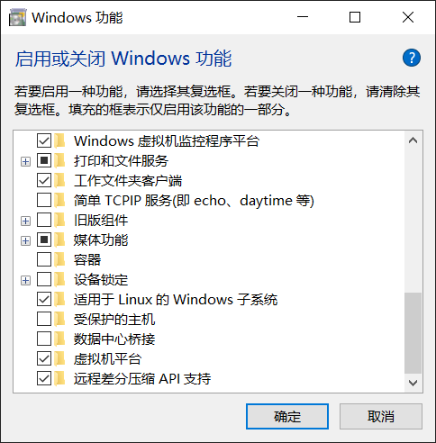
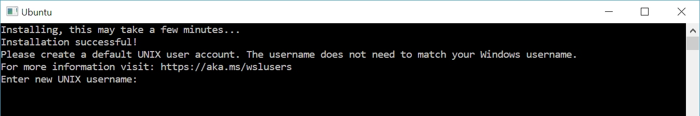

<!-- autoHeader:0 -->

> 目的：拥有一个Linux系统

# 引言

安装Linux系统需求一般分为两种场景：

1. 已经拥有Windows系统，还需要一个Linux环境
2. 在一台新的机器上安装一个全新的Linux系统

**鉴于Windows系统的普及性和简便性, 绝大多数属于第一种情况, 因此强烈推荐不想折腾的话, 完成 [安装WSL](#安装wsl) 即可.**

# 在Windows上安装Linux

Windows是使用最广泛的系统，在机器安装了Windows的同时还需要Linux系统，解决方案如下，难度逐渐增加：

1. 在win中安装适用于 Linux 的 Windows 子系统——Windows Subsystem for Linux (WSL)
2. 先在win中安装虚拟软件，再安装Linux虚拟机
3. 在机器上安装双系统

**新手完成第一种方式即可.**

## 安装WSL

- 适用于 Linux 的 Windows 子系统 (WSL) 是 Windows 的一项功能，与传统虚拟机相比，占用的资源量少。
- 必须先启用“适用于 Linux 的 Windows 子系统”可选功能，然后才能在 Windows 上安装 Linux 发行版。
- WSL有两个版本 WSL 1 和 WSL 2 。WSL2拥有完整的Linux内核，性能和兼容性更改好，鉴于现在个人电脑几乎都是win10、win11，选择安装WSL2。
- **此小节中的命令均为 Windows PoweShell 命令。**

### 步骤1

- 首先根据系统版本选择安装方式:
  - 检查Windows系统版本：“Win键 + R” >键入“winver” >选择“确定”
  - 安装WSL2要求**高于一定版本的Windows10或者任何版本的Windows11**
    - 对于win10 x64 系统：要求版本 1903 或更高版本，内部版本为 18362.1049 或更高版本。
    - 对于win10 ARM64 系统：要求版本 2004 或更高版本，内部版本为 19041 或更高版本。
      - 如何确定自己计算机的类型（x64或者ARM64）：win键+R >搜索 cmd 或 PowerShell >打开并输入：`systeminfo`，在输出中查看“系统类型”。(个人用计算机几乎都是x64)
    - 如果是Windows 10 版本 2004 及更高版本（内部版本 19041 及更高版本）或 Windows 11，可以跳到[步骤3](#步骤3)使用命令行安装。
    - 介于上述版本之间的Windows10(即 1903-2004 之间)需要采用下面的手动安装方式.
    - 低于1903版本, 需要更新Windows版本

### 步骤2

- 开启Windows功能：桌面搜索框搜索“功能” >打开“启用或关闭Windows功能” >在最下面找到并勾选“适用于 Linux 的 Windows 子系统”和“虚拟机平台”
- 
- **步骤2**——命令行实现(上一步做了这一步跳过)：“开始”菜单 >“PowerShell” >单击右键 >“以管理员身份运行”，然后输入以下命令：

```powershell
dism.exe /online /enable-feature /featurename:Microsoft-Windows-Subsystem-Linux /all /norestart
dism.exe /online /enable-feature /featurename:VirtualMachinePlatform /all /norestart
```

- **然后重启计算机**，然后执行[步骤4](#步骤4)开始手动安装。

### 步骤3

- 一个命令安装运行 WSL 所需的一切内容：win键 >搜索“powershell” >“PowerShell” >单击右键 >“以管理员身份运行” >输入命令: `wsl --install`
- 上述命令将默认安装 Linux 的 Ubuntu 发行版. 如果你不了解, 保持默认即可; 若想安装其它发行版，可以使用下面的命令更改版本(这一步与上一步选择一个执行即可)：

```powershell
#列出可用的 Linux 发行版
wsl --list --online
#选择一个版本安装
wsl --install -d <Distribution Name>
```

- **然后重启计算机**, 再次回到 PowerShell，输入 `wsl`启动Linux，或者使用“开始”菜单打开该发行版（默认情况下为 Ubuntu）。系统将要求你为 Linux 发行版创建“用户名”和“密码”。
  - 此用户名和密码特定于安装的每个单独的 Linux 分发版，与 Windows 用户名无关。
  - 请注意，输入密码时，屏幕上不会显示任何内容。 这称为盲人键入。 你不会看到你正在键入的内容，这是完全正常的。
  - 创建用户名和密码后，该帐户将是分发版的默认用户，并将在启动时自动登录。
  - 此帐户将被视为 Linux 管理员，能够运行 sudo (Super User Do) 管理命令。
- 然后执行[步骤5](#步骤5)

### 步骤4

- 下载 Linux 内核更新包
  - [适用于 x64 计算机的 WSL2 Linux 内核更新包](https://wslstorestorage.blob.core.windows.net/wslblob/wsl_update_x64.msi)
  - [适用于ARM64 计算机的WSL2 Linux 内核更新包](https://wslstorestorage.blob.core.windows.net/wslblob/wsl_update_arm64.msi)
- 运行上一步中下载的更新包。（双击以运行 - 系统将提示你提供提升的权限，选择“是”以批准此安装。）
- 将 WSL 2 设置为默认版本: win键 >搜索“powershell” >“PowerShell” >单击右键 >“以管理员身份运行” >在PowerShell中输入命令 `wsl --set-default-version 2`
- 打开微软商店，搜索你偏好的 Linux 分发版(如果你不了解, 选择下面第一个Ubuntu即可)，选择“获取”即可安装。
  - 下面是网页连接，可以跳转到微软商店或者下载 `.exe`安装程序:
  - [Ubuntu 22.04 LTS](https://apps.microsoft.com/detail/9pn20msr04dw?rtc=1&hl=zh-CN&gl=CN)
  - [Debian GNU/Linux](https://apps.microsoft.com/detail/9msvkqc78pk6?rtc=1&hl=zh-CN&gl=CN)
- 完成后可以在“开始”菜单找到刚安装的Linux发行版, 打开它。首次启动新安装的 Linux 分发版时，将打开一个控制台窗口，系统会要求你等待一分钟或两分钟，以便文件解压缩并存储到电脑上。为新的 Linux 分发版创建用户帐户和密码。
  

### 步骤5

- 检查是否成功安装WSL2，打开 PowerShell，输入命令 `wsl --list --verbose`查看安装的WSL版本.
- 输出应该如下：

```terminal
  NAME      STATE           VERSION
* Ubuntu    Stopped         2
```

**当你看到Linux发行版的名字及版本，祝贺你！ 已成功安装了与 Windows 操作系统完全集成的 Linux ！**

### 卸载WSL

- 想要删除一个WSL发行版与该发行版相关的所有数据，请运行 `wsl --unregister <distroName>`，其中 `<distroName>` 是你的 Linux 发行版的名称，可以用 `wsl -l` 命令的列表中查看已安装的发行版的名称。此外，可以像卸载任何其他应用商店应用程序一样，在计算机上卸载 Linux 发行版应用
- 更多设置及命令在[微软WSL文档](https://learn.microsoft.com/zh-cn/windows/wsl/)中可以找到。

## 通过虚拟机安装Linux

**Windows WSL2 已经完全满足需求, 此方法仅作备选方案**, 大致流程如下:

- VMware是一款知名的虚拟化软件，它通过虚拟化技术，允许用户在同一台物理计算机上运行多个操作系统。2024年5月14日开始，**VMware对个人使用完全免费**。
- 首先注册下载软件：[Workstation Pro 17.5.2 下载](https://access.broadcom.com/default/ui/v1/signin/) (适用于 Windows 桌面上的虚拟化)
- 像Windows其它应用程序一样安装好后, 就可以得到一个虚拟环境
- 打开VMware，选择“创建新的虚拟机”。
- 选择“典型（推荐）”安装方式，然后选择“稍后安装操作系统”。
- 在操作系统类型中选择“Linux”，并根据需要选择具体的Linux发版本（如Ubuntu、CentOS等）
- 然后根据题提示设置名称和存储位置, 根据实际需求分配处理器, 内存和磁盘
- 在虚拟机设置中，将光驱设置为ISO映像文件路径，指向下载的Linux系统镜像文件 (.iso 镜像文件一般从各种Linux发行版的官网可以下载到)
- 启动虚拟机，系统会自动加载ISO镜像中的安装程序。
- 然后根据安装向导安装即可, 过程类似Windows系统的激活过程
- 安装完成后，重启进入系统即可得到一个运行在虚拟软件中的Linux系统
- 如果你觉得不够详细, 相关教程网络上所处可见. 参考教程: [VMware虚拟机17.6安装Ubuntu20.04教程(宝宝级攻略)-CSDN博客](https://blog.csdn.net/2301_76831056/article/details/142769348)

## 双系统

如果你需要一个从各个方面来说都完整的Linux系统, 还不想舍弃Windows, 双系统是最好的选择. 除了需要配置一些启动文件以外, 这几乎和单独安装Linux系统没有任何区别.

既然都选择了拥有一个开源的Linux, 我希望它是自由的, 在众多发行版中选择了自由的 Arch Linux, 它允许用户从安装到配置的每一个细节都进行自定义.

感谢伟大的开源运动, 让所有人有自由使用权利.

### 安装自由的Arch Linux

待更新……

# 安装独立的Linux

此方法与双系统安装过程类似, 甚至更为简单, 不做更多的记录.
