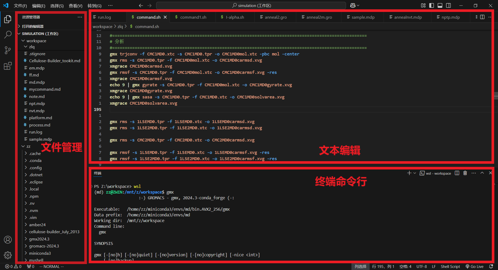

# 强大的文本编辑器

- GROMACS等开源分子模拟软件是基于命令行界面交互的, 且分子信息都是存储在文本文件中的, 因此我们离不开对文本的操纵编辑, 离不开对命令行的使用.
- Visual Studio Code (VScode)是微软开发的一款免费、开源的跨平台代码编辑器, 集成了分子模拟需要的三大功能: 文本编辑, 文件管理, 命令行终端. 一个窗口就能完成分子模拟的全部操作.

- 你还可以在 VScode 中编辑自己的笔记, 甚至你所看到的这篇文章也是通过vscode编辑的.
- 安装简单, 在官网下载.exe文件安装即可.
- 官网地址: [Visual Studio Code - Code Editing. Redefined](https://code.visualstudio.com/)
- 上手简单, 它就是一文本编辑器能有多难?
- 插件丰富, 可拓展性强. 支持中文!!!

## 使用技巧

待更新......