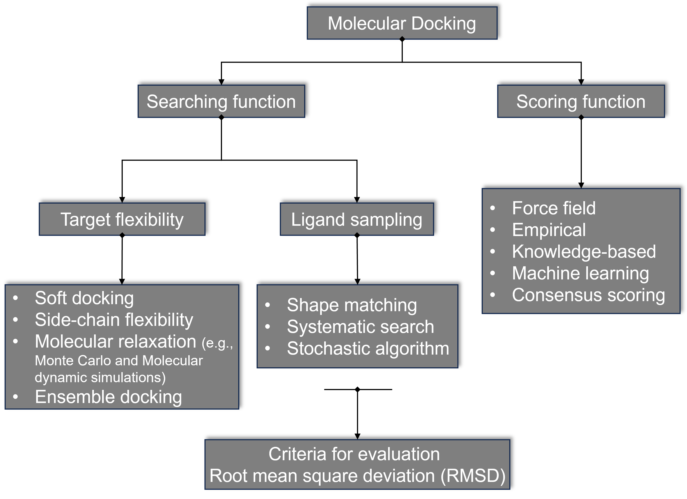
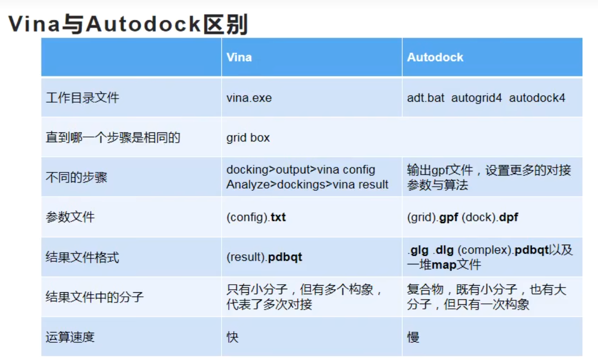
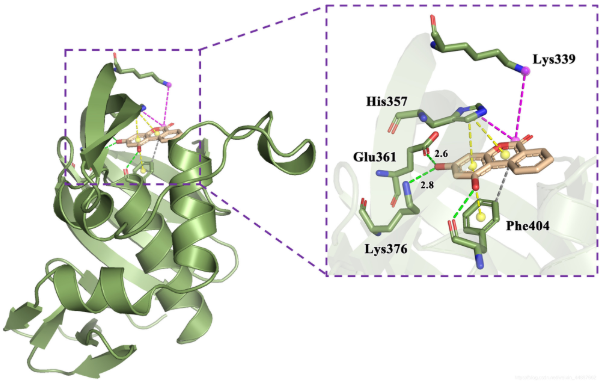

# 分子对接概述
## 定义

定义1：分子对接是通过受体的特征以及受体和药物分子之间的相互作用方式来进行药物设计的方法。主要研究分子间 (如配体和受体) 相互作用,并预测其结合模式和亲合力的一种理论模拟方法。

定义2：分子对接即在计算机中模拟分子识别的过程，其目的是为了找出蛋白及其配体的最佳结合构象，并确保复合物整体的结合自由能最低。

## 原理

- 分子对接(Molecular Docking)：是指根据受体和配体之间通过能量匹配、空间匹配和化学性质匹配来预测相互结合模式及结合力强弱的一种计算技术。
- **分子对接（molecular docking）是分子模拟的重要方法之一**，其本质是两个或者多个分子之间的识别过程，早期的分子对接方法使用分子力学方法或者量子化学方法计算小分子之间分子识别，然而由于算法和计算机处理能力的限制，较难处理含有大分子的分子对接过程。随着计算机算力的大幅提升，几何匹配计算通常采用格点计算，片段生长等方法，能量计算则使用**模拟退火、遗传算法**等方法，广义上定义为**刚性对接，半柔性对接与柔性对接**这三种对接方法。空间匹配是分子间发生相互作用的基础，能量匹配是分子间保持稳定结合的基础。通过空间匹配和能量匹配，目前分子对接方法在小分子药物设计、多肽类药物设计、抗体类药物设计以及核酸抑制剂等领域有着广泛的应用。
- 分子间相互作用中涉及许多力，主要包括：疏水作用（Hydrophobic）、范德华力（Van der Waals）、芳香氨基酸之间的堆积作用、氢键（Hydrogen bonding）和静电力（Electrostatic forces）。将配体对接到受体结合位点的过程试图模拟配体和其受体之间的相互作用的最小能量。
- 分类：
  **(1)刚性对接:**
  靶点分子和配体分子在对接过程中构象不变，只有分子的空间位置和姿态发生变化。该方法计算简略，计算速度快，适合于结构比较大的大分子之间的对接计算，计算结果不够精确。
  **(2)半柔性对接:**
  半柔性对接是药物筛选过程中常用的一种方法，在对接过程中，靶点分子构象不变，配体分子构象在一定范围内发生变化。该方法适合于大分子和小分子化合物之间的对接计算。其计算量较小，速度较快。
  **(3)柔性对接**
  靶点分子和配体分子在对接时构象均可发生变化。该对接方法计算量大，计算精确，速度慢，适合于精确研究分子间的识别情况。有报道称将配体和受体视为柔性结构得到的对接结果更为准确。

## 什么是 Superposition

分子叠加‌(Superposition)：是一种将多个分子的结构进行对齐的操作，以便比较它们的相似性和差异性。它不涉及计算分子之间的相互作用或结合能，而是用于分析分子的空间构型和结构特征。分子叠加常用于结构生物学研究中，比如比较不同蛋白质的结构差异，或者在同一分子在不同条件下的构象变化。这种技术有助于理解分子的结构和功能关系，但并不直接涉及新药的设计或材料的开发‌

## 对接流程

1. 首先准备配体结构文件，对其进行预处理（结构转换、结构优化）；
2. 准备蛋白的晶体结构文件，对其进行预处理（结构修复和调整）；
3. 如果没有蛋白晶体结构，我们需要完整的氨基酸序列进行结构建模（同源建模）；
4. 准备好蛋白之后需要进行活性位点预测，找出大致的对接口袋位置；
5. 以预测的口袋位置中心为坐标原点建立对接盒子，形状大小视项目而定；
6. 对接盒子大小等参数根据对接的配体信息（例如配体大小）进行设定；
7. 以上步骤确定好后，需要设定最后的对接参数以及选择对接精度；
8. 检查结构文件和参数文件，视项目情况调用服务器资源启，动对接程序。

整个分子对接计算的过程主要包含**构象搜索**算法（Searching function）和**打分函数**（Scoring function）两部分：

1. 构象搜索（Searching function）: 构象搜索（Searching function）算法创建最佳数量的配置，其中包括实验确定的结合模式。尽管严格的搜索算法会遍历两个分子之间所有可能的结合模式，但由于搜索空间的大小和完成可能需要的时间，这种搜索是不切实际的。因此，只能对总构象空间的一小部分进行采样，因此必须在计算费用和检查的搜索空间量之间达到平衡。一些常见的搜索算法包括分子动力学、蒙特卡罗方法、遗传算法、基于片段、点互补和距离几何方法、禁忌和系统搜索。
2. 打分函数（Scoring function）: 打分函数（Scoring function）由许多数学方法组成，用于预测称为结合亲和力的非共价相互作用的强度。所有的计算方法的目标都是开发一种可以快速、准确地描述蛋白质和配体之间的相互作用的能量打分函数。目前主流的打分方程算法包括基于力场、半经验、基于知识、机器学习和一致性评价等。
    1. 基于力场的打分函数: 基于力场的打分函数以分子力学计算为中心，包含范德华相互作用（Lennard-Jones 势）、静电相互作用（库仑势）和去溶剂化能等。这些力学参数可以从实验数据或从头算量子力学计算中得出。但由于计算成本的原因，在基于力场的打分函数中，溶剂化和熵项通常被过度简化或忽略。 GoldScore、DOCK 和 AutoDock 的早期版本等程序都使用这种类型的评分功能。
    2. 基于知识的打分函数: 基于知识的打分函数由源自实验确定的蛋白质配体结构的统计势组成。许多蛋白质-配体复合物的特定相互作用的频率用于通过逆玻尔兹曼分布产生这些电势。这种方法使用大量的蛋白质-配体原子成对项来近似复杂且难以表征的物理相互作用。因此，打分函数缺乏直接的物理解释。DrugScore、ITScore 和 PMF 是基于知识的评分函数的示例。
    3. 半经验的打分函数: 基于半经验的打分函数通过一组加权打分项来表征“蛋白质-配体”复合物的结合亲和力。这些打分项可能包括 VDW、静电、氢键、疏水、去溶剂化、熵等。他们的相应权重是通过线性回归拟合“蛋白质-配体”复合物的实验结合亲和力数据来确定的。基于经验的打分函数使用与基于力场的打分函数类似的组成项，每一项的贡献（权重）是从训练数据中学习的，类似于基于知识的评分函数。与基于知识的打分函数相比，由于物理项的限制，经验打分函数不太容易出现过度拟合。 例如 ChemScore、GlideScore、X-Score 和 Autodock Vina 等都是基于半经验的打分函数。
    4. 基于机器学习的打分函数: 基于机器学习的打分函数是一组使用机器学习算法，通过关联训练数据中的模式来学习结合亲和力的函数形式的方法。在不采用预定函数形式的情况下，机器学习评分函数可以隐式捕获难以显式建模的分子间相互作用。近年来，ML 评分函数在结合亲和力预测方面显示出显着改进。

## 对接软件

只要在期刊网站中随便一搜索就会发现对接软件的文章非常之多，是一个热门领域：
- **免费软件**：Dock、AutoDock、Vina、Ledock、[UCSF DOCK](http://dock.compbio.ucsf.edu/)
- **商业软件**：Glide、GOLD、MOE Dock、Surflex-Dock、LigandFit、FlexX等，Discovery Studio中也有对接模块，商业软件的对接界面都进行了更加友好的设计，因此操作起来更加便捷

### AutoDock系列

- Autodock是一款开源的分子模拟软件，由Scripps研究所的Olson实验室开发与维护，主要应用于**生物大分子与小分子配体**的对接。
- 使用.pdbqt 文件：在pdb文件的基础上加了电荷（Q）和原子类型（T）
- 加氢：**在选择一个分子作为配体或受体之前，必须把所有的氢都加到这个分子上**，这样才能计算原子电荷。什么时候加全氢、什么时候加极性氢：官方的手册里必须加全氢，实际上vina是先加氢，最后处理的时候，自动算成极化氢。计算原子电荷使用的是极性氢。
- 电荷：autodocktools(ADT)会检查分子是否带有电荷。如果没有，它会给每个原子加上Gasteiger电荷，如果分子已经带电荷，ADT会问你是否想保留输入电荷而不是增加Gasteiger电荷。ADT会合并非极性氢，如果你不需要，需要手动设置。极性氢是与氧和氮等电负性原子键合的氢。非极性氢是与碳原子键合的氢。所以，不需要手动点edit->charges->compute Gasteiger
- grid box spacing，**网格点间距**
- 典型的**网格点间距**从0.2Å到1.0Å不等，默认值是0.375Å(大约是碳碳单键长度的四分之一)。即 spacing = 0.375
- number of point：网格数目，网格数目乘以网格点间距即为盒子大小
- 设置对接的盒子大小、坐标、格点数、格点距离，这一步需要自己根据不同的结构来进行具体确认。一般来说最简单的方法是：查阅文献、晶体结构数据库，寻找配体可能的结合位点附近的重要氨基酸残基。对接的中心坐标并不一定非常准确，只要对接的盒子包含了配体可能结合的最大区域即可。
- 建议对接次数，number of GA runs : 50
- **预测的结合亲和力以 kcal/mol 为单位**，如果结合能小于-1.2kcal/mol或者小于-5kj/mol，那么我们认为对接结果是可行的
- 
- 亲和力能量、电荷能量。1、亲和力能量：分子间的非共价相互作用力，包括范德华力和氢键等。通常是负数，代表分子间引力的大小。2、电荷能量：分子间的静电相互作用力，包括静电相互作用和极化能等。通常是负数，代表分子间的排斥力大小。
- [分子对接教程 | AutoDock对接操作与对接结果解读](https://mp.weixin.qq.com/s?__biz=MzI2ODk5ODQwOA==&mid=2247487437&idx=1&sn=24c121917ec00b1ef76c54bdfc57551a&chksm=eae64daadd91c4bc46956f26478820e31db0f82d6d4aac9c496bd5560dde6fb9704c8a865676&scene=27)

#### Vina

- 新一代的分子对接工具，AutoDock升级版
- 不需要计算网格图和分配原子电荷
- 不需要 AutoDock 和 AutoGrid 参数文件（GPF、DPF）和网格映射文件
- [AutoDock Vina进行分子对接步骤详细解析](https://zhuanlan.zhihu.com/p/146301168?utm_source=wechat_session)

#### config.txt文件参数

- 推荐 exhaustiveness = 10
- 应该避免大于 30 x 30 x 30 埃的搜索空间
- num_modes = 20 结果中生成的最大结合数，即多少个结果，输出最好的20个结果
- cpu = 10 运算核数
- energy_range = 4 最佳结合模式和最差结合模式之间的最大能量差（千卡/摩尔）

## 蛋白质对接

### ZDOCK

- ZDOCK和M-ZDOCK都是基于快速傅立叶变换的蛋白质相互作用对接程序，该程序由马萨诸塞大学医学院的Zhiping Weng的实验室（ZLAB）提供并维护。[ZDOCK: Protein Docking (umassmed.edu)](https://zlab.umassmed.edu/zdock/index.shtml)
- ZDOCK程序主要用来搜索两种蛋白质之间通过平移和旋转而得到的空间中所有可能的相互结合模式，并使用基于能量的评分函数评估每个结合模型。ZDOCK程序对于学术用户是免费使用的，同时其也集成到了很多的商业化软件中。作为学术用户可以通过其官方网站填写邮箱地址获取学术版的下载地址。[Protein Docking Software (ZDOCK &amp; RDOCK) (wenglab.org)](https://zdock.wenglab.org/software/)
- 提供了几种蛋白质对接算法，包括：
  - **ZDOCK**: 对两种蛋白质之间的对接方向进行完整的**刚体搜索**。目前版本ZDOCK 3.0.2，使用IFACE统计势能，结构互补和静电等构成的打分函数
  - **[M-ZDOCK](http://zlab.umassmed.edu/m-zdock)**: ZDOCK 的修改，用于使用亚基结构预测对称组装。
  - **ZRANK**: 一个对接改进程序，旨在对初始阶段对接（例如来自 ZDOCK）的模型以及改进的对接模型（例如来自 RosettaDock）提供快速准确的重新评分。
  - **RDOCK**: 一种较旧的对接优化协议，它利用了初始阶段对接模型的结构最小化和重新评分。
- web serve：[ZDOCK Server: An automatic protein docking server (umassmed.edu)](https://zdock.umassmed.edu/)
- 注意：ZDOCK**只支持蛋白质分子**

### Rosetta

- RosettaDock 是一个用于“蛋白质-蛋白质”或“蛋白质-配体”相互作用的计算机模拟和蛋白质结构预测的软件工具，它是[Rosetta](https://www.rosettacommons.org/)软件套件的一部分。
- Rosetta 是一个广泛用于蛋白质结构预测、蛋白质折叠、蛋白质-蛋白质和蛋白质-配体相互作用等生物信息学任务的计算生物学工具。
- [[ROSIE] Docking Protocol (jhu.edu)](https://rosie.graylab.jhu.edu/docking)

### GRAMM

- 刚体对接，来自[Vakser Lab|Research (ku.edu)](https://vakserlab.ku.edu/)
- web serve：[Vakser Lab - GRAMM Web (ku.edu)](https://gramm.compbio.ku.edu/)，教育邮箱即可使用。

### Hex Protein Docking

- Hex 是一个交互式蛋白质对接和分子叠加程序，假设配体是刚性的，Hex 还可以计算蛋白质-配体对接，并且它可以仅使用分子对的 3D 形状知识来叠加分子对。是唯一一个使用球形极傅里叶 （SPF） 相关性来加速计算的对接和超级定位程序，第一个能够使用现代图形处理器单元 （GPU） 来加速计算的蛋白质对接程序。
- 官网：[Hex Protein Docking (loria.fr)](https://hex.loria.fr/)
- 可以是非蛋白质

### PatchDock and SymmDock and FireDock

- PatchDock 方法可对蛋白质-蛋白质和蛋白质-小分子复合物进行结构预测（基于形状互补原理的分子对接算法）。输入是任何类型的两个分子：蛋白质、DNA、肽、药物。输出是按形状互补性标准排序的潜在复合物列表。
- SymmDock 方法在给定单体单元的结构的情况下预测具有循环对称性的同源多聚体的结构。
- web serve：[PatchDock Server: An Automatic Server for Molecular Docking (tau.ac.il)](https://www.cs.tau.ac.il/~ppdock/PatchDock/)，用不了
- 下载：[Installing PatchDock on Ubuntu (Linux) — Bioinformatics Review](https://bioinformaticsreview.com/20210709/installing-patchdock-on-ubuntu-linux/)，报错（Segmentation fault (core dumped)）
- FireDock：用于蛋白质-蛋白质对接结果的灵活精炼和评分。先执行 PatchDock 刚体对接，再通过 FireDock 对结果进行重定向以进行优化和评分。

### RxDock

- rDock为ZDock的升级算法
- RxDock 是一个快速且多功能的开源对接程序，可用于对接小分子与蛋白质、核酸。RxDock 是 rDock （GitLab） 的一个分支，目标是更新代码以在现代计算机系统（包括超级计算机）上运行并实现跨平台使用。
- 官网：[RxDock – modern, actively maintained, and cross-platform fork of rDock](https://rxdock.gitlab.io/)
- 对比：[rDock and RxDock – fast, versatile, and open-source programs for docking ligands to proteins and nucleic acids](https://rdock.gitlab.io/)

### RPXDock

- 在各种对称架构中进行序列无关的刚体蛋白对接，用于在多个对称架构中对称蛋白质复合物进行建模、采样和评分。
- 官网：[GitHub - willsheffler/rpxdock: protein docking stuff](https://github.com/willsheffler/rpxdock)

### 其它

- FlexDock：是一种用于灵活铰链弯曲蛋白质-蛋白质对接的算法，[opencollab/flexdock (github.com)](https://github.com/opencollab/flexdock)
- UCSF DOCK
- FLIPDock
- EADock
- HADDOCK 2.2：可以做大分子与大分子对接，[Protein-protein docking using HADDOCK2.4 web server — Bioinformatics Review](https://bioinformaticsreview.com/20210708/protein-protein-docking-using-haddock2-4-web-server/)
- SwissDock：用于进行蛋白质与小分子之间相互作用的模拟，[SwissDock](https://www.swissdock.ch/)
- ClusPro：蛋白质-蛋白质刚体对接，只接受蛋白质文件，[ClusPro 2.0: protein-protein docking](https://cluspro.org/help.php)
- CHDOCK：许多蛋白质（如离子通道）是由对称的同源寡聚体形成的，是一种用于建模 Cn 对称同源寡聚物复合物的分层对接方法，来预测 Cn 对称蛋白质复合物的结构，类似SymmDock、M-ZDOCK、SAM。
- HSYMDOCK，web serve：[HSYMDOCK Server (hust.edu.cn)](http://huanglab.phys.hust.edu.cn/hsymdock/)
- GalaxyTongDock：对称和非对称 ab initio 蛋白质-蛋白质对接，类似ZDOCK

## 结果分析

### PLIP

- Protein-Ligand Interaction Profiler（PLIP）, 用于分析和可视化蛋白质与配体之间的非共价相互作用.
- PLIP 工具基于Python开发，依赖于OpenBabel进行分子操作，并支持PyMOL进行交互式可视化.
- 提供Web服务和命令行模式.
- 能够检测和报告多种类型的相互作用，包括氢键、疏水接触、π-堆叠、盐桥、水桥和卤键等.
- **特别用于蛋白质-配体复合物的非共价相互作用分析方面**
- #开源
- webserve: [PLIP (tu-dresden.de)](https://plip-tool.biotec.tu-dresden.de/plip-web/plip/index)
- GitHub: [pharmai/plip](https://github.com/pharmai/plip)
- 文献: https://doi.org/10.1093/nar/gkab294
- [PLIP：蛋白配体非共价相互作用分析利器 - 知乎](https://zhuanlan.zhihu.com/p/149823111)

### ProteinsPlus

- 一个基于网络的蛋白质结构分析平台.
- 还提供了一系列分子建模工具，**专注于蛋白质-配体相互作用的研究**
- 功能包括氢原子预测、配体识别、相互作用网络分析、状态选择等，这些功能通过不同的服务模块实现，如Protoss软件用于氢原子预测，PoseView软件用于交互式2D可视化.
- webserve: [Universität Hamburg - Proteins Plus Server](https://proteins.plus/), 登录即可使用

### LigPlot+

- LigPlot+是一款基于java界面运行的2D分子间相互作用图绘制软件.
- 可以分析蛋白配体之间的相互作用、蛋白-蛋白的作用界面、以及绘制抗原-抗体的相互作用。
- #学术免费
- 官网: [LigPlot+ home page](https://www.ebi.ac.uk/thornton-srv/software/LigPlus/) 注册即可下载
- [分子动力学||LigPlot+下载安装及绘图教程 - 知乎](https://zhuanlan.zhihu.com/p/470635337)

### pymol

- pymol可以绘制蛋白质-配体分子的结合模式图, 效果如图:
- 
- [使用PyMOL绘制蛋白与配体分子结合模式图-CSDN博客](https://blog.csdn.net/qq_37126941/article/details/115793062)

### VMD

- VMD是用于生物分子可视化和分析的软件，支持加载蛋白质和小分子的结构，并生成交互式的2D相互作用图片。

### Schrodinger

- Schrodinger(薛定谔)是一款功能强大的计算化学软件，广泛应用于生命科学、材料科学和药物研发等领域。
- #商业软件
- 提供了多种工具来分析非共价相互作用力.

### Discovery Studio

- Discovery Studio 的Visualizer工具可以用于加载和分析蛋白质和小分子的结构，并生成各种类型的2D相互作用图片。

## 分子对接的应用

### 计算机辅助药物设计CADD

例如大批量的药物筛选

### 分子对接与分子动力学模拟的联系

1. 分子对接有三种方式，刚性对接（配体受体全刚性）半柔性对接（配体柔性，受体刚性）全柔性对接（配体柔性，受体活性部位氨基酸残基柔性）即便是全柔性对接，蛋白质也只是活性口袋的几个氨基酸残基在动，整个蛋白除了几个氨基酸残基以外是固定的。根据酶-受体的诱导契合模型，蛋白也会作出相应的构象改变去适应配体，蛋白整体都会有轻微/剧烈的运动，不太可能只有几个氨基酸残基在动而其他部分完全不动。分子对接完全没法体现蛋白整体的运动；此外，分子对接未考虑时间因素，只看是否结合，有可能结合上去马上就掉下来了。所以说做分子动力学是有必要的
2. 一般做法是对接选出几种结合模式再做分子动力学。原因如下（1）分子动力学模拟是比较耗计算资源的，做一次模拟的成本比分子对接高的多，如果没有分子对接做参考直接做分子动力学感觉比较浪费计算资源（2）分子动力学结果重现性较差，可能几次跑出来结果不一样，如果初始结构没有依据的话（没做过分子对接或者是其他预测）要想得到好的结果会比较困难
3. 可靠性：分子对接只是从打分函数+构型构象空间采样的层面给你找出较好的结合方式，但这对于判断是否能稳定结合方面可靠度比较有限。而在合适的力场、恰当的设定下做动力学模拟，相当于通过用计算机来做实验检验在实际环境中配体是否能稳定结合，这有说服力得多。原理上，如果打分函数能直接准确预测结合自由能那是再好不过，但现实中用的各种打分函数考虑的因素都相当有限，更多实际意义在于判断较好结合位置、对结合方式进行排序，而与结合自由能的相关性并不多强。而通过分子动力学，则可以利用MM/GBSA、MM/PBSA、TI/FEP等方式计算绝对的结合自由能，比起对接过程的打分更有现实意义和物理意义。
4. 作为分子动力学模拟的起始结构：原理上，直接跑无穷长时间的蛋白+配体，最后做轨迹分析判断配体在哪里结合最理想，这是可以的，但在模拟时间尺度有限的现实情况中一般行不通。比如把配体随意放在蛋白质旁边，很可能配体在跑进最理想结合位点之前经常停留在其它地方，浪费巨量模拟时间，甚至在一个亚稳的结合位点一直不出来，导致不仅最稳定结合位置展现不出来，还可能导致严重的误判。

## 拓展阅读

- [分子对接（molecular docking）技术服务- 佰莱博生物](https://www.bilibili.com/read/cv27739317/)
- [《分子对接：方法，应用和未来前景浅析》——分子对接的原理](https://www.bilibili.com/read/cv25176873/)
- [分子对接软件：综述 - 知乎 (zhihu.com)](https://zhuanlan.zhihu.com/p/342466207)
- [分子对接及结果分析在线工具_在线分子对接-CSDN博客](https://blog.csdn.net/Obsidian_wz/article/details/126739676)
- [一篇全面测试Autodock、Vina和其它程序对接精度的文章(JCIM,2018) - 分子模拟 (Molecular Modeling) - 计算化学公社 (keinsci.com)](http://bbs.keinsci.com/thread-13283-1-1.html)
- [科学网—一文读懂蛋白质间的分子对接 - 杨鸽的博文 (sciencenet.cn)](https://blog.sciencenet.cn/blog-3435595-1318308.html)
- [多种分子对接生成蛋白和小分子的2D相互作用图片 - 哔哩哔哩](https://www.bilibili.com/opus/814454669833142272)
