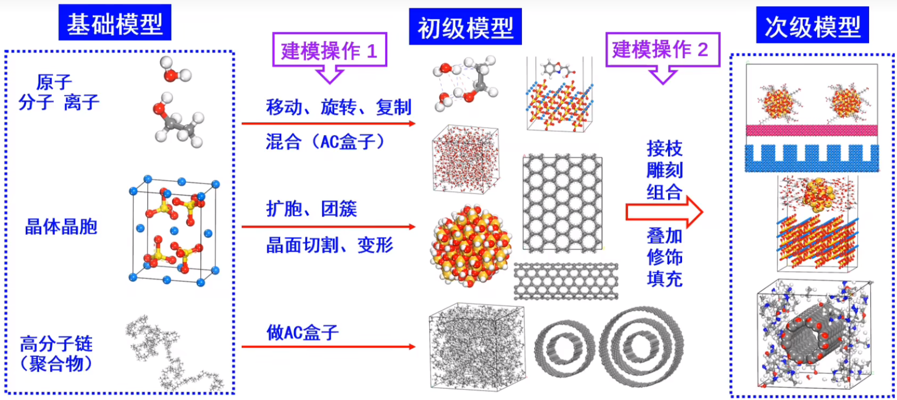
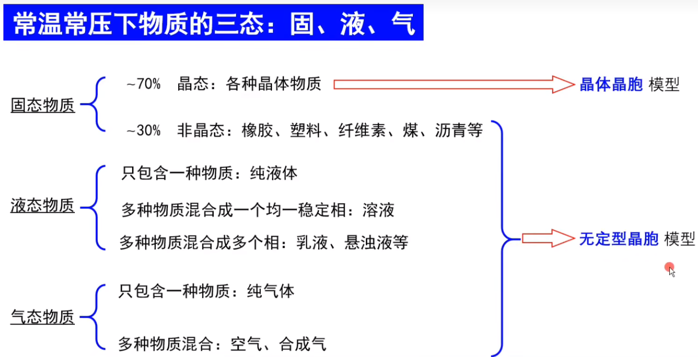

# 概述

molecular modeling（MM）, 是分子模拟的必备步骤. 在进行分子模拟之前，首先要把相应的实际物理模型转化为分子模拟可用的[化学体系结构文件](化学物质#化学体系结构文件).

- 分子建模表明了根据现实原子模型描述复杂化学系统的一般过程，其目标是基于原子尺度的详细知识来理解和预测宏观特性。
- 分子建模原则
  1. 代表性：抓住研究对象的关键特点，简化而不失真
  2. 可用性：尺寸适中、计算量可接受，算得动
- **数据来源：**
  - 化学数据库
  - 文献报告
  - 实验数据
- **模型和模拟的联系：**
  - 模型处理用于分析和解释实验现象，分子会采取什么样的构象，候选药物是否能够与靶蛋白结合等问题的解答；模拟用于给定一个初始模型和条件进行计算，用于预测体系动态变化。

## 模型分类

- 原子、分子模型
- 晶体模型（一般指小分子晶体）
- 简单溶液模型
- 聚合物模型
- 晶面模型
- 填充
- 界面模型

## 模拟环境

- 液相环境: 溶剂分子填充满整个盒子
- 真空环境: 只有感兴趣的分子, 被真空包围
- 晶体环境: 键跨过盒子边界, 无限扩展

## 同源建模

- **同源建模**是蛋白质结构预测最流行的计算方法之一。
- 利用蛋白质结构的进化保守性来预测蛋白质的 3D 结构。
- 从相同的共同祖先（同源性）进化而来的两种蛋白质往往具有相似的 3D 结构。
- 对于人为设计的新的蛋白质，没有数据库、文献查询其模型结构，可以用同源建模技术获取其结构数据
- [使用同源建模预测蛋白质结构_同源建模法预测蛋白质结构-CSDN博客](https://blog.csdn.net/m0_49960764/article/details/121848537)
