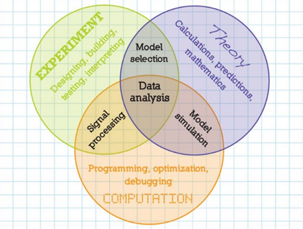
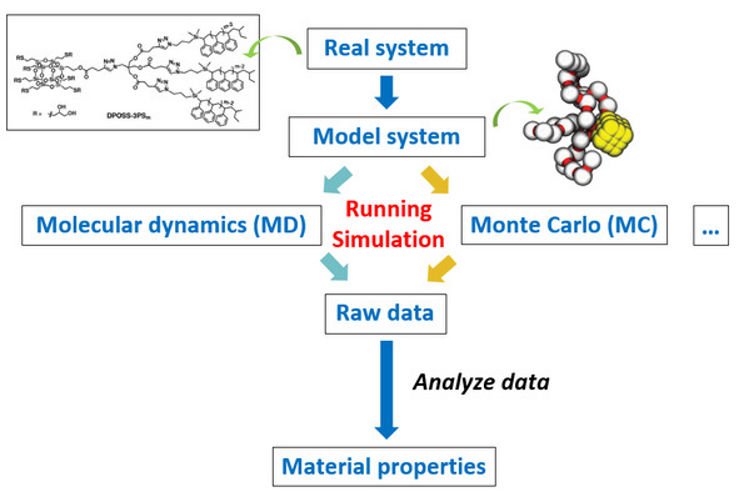
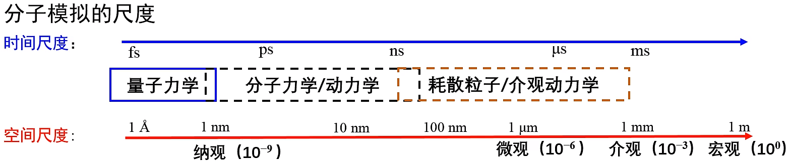
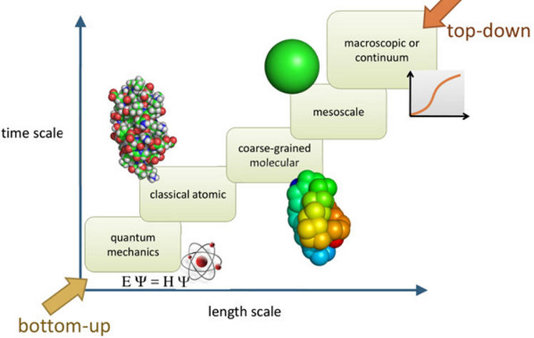
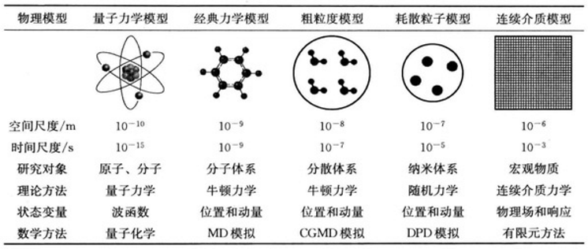

# 分子模拟概述

## 认识分子模拟

分子系统的计算机模拟使得可以在**亚原子，原子，超原子或超分子水平**上描述分子过程的结构-能量-功能关系，并在化学，生物学和物理学中发挥着越来越重要的作用。

>分子模拟在学科知识体系中的位置: 化学 →理论化学 →计算化学 →**分子模拟**

1. **计算化学**：是理论化学的一个分支，主要目的是利用有效的数学近似以及电脑程序计算分子的性质，表示计算技术在化学中的应用，范围从分子的量子力学到大型复杂分子聚集体的动力学。计算化学研究的主要内容包括：
    - 原子和分子的计算机表述
    - 利用计算机协助存储和搜索化学信息数据 （参见化学数据库）
    - 研究化学结构与性质之间的关系 （参见定量构效关系(QSAR)及定量构性关系(QSPR)）
    - 根据对作用力模拟对化学结构进行理论阐释
    - 计算机辅助化合物合成
    - 计算机辅助特性分子设计（例如计算机辅助药物设计）
2. **分子模拟**：molecular simulation（MS），是使用计算机以原子水平的分子模型来模拟分子的结构和行为，从而获得模型的物理和化学性质。模拟可以基于量子力学、分子力学/牛顿力学等, 由此分子模拟的主要分类：
    - 量子力学
        - 量子化学计算
        - 第一性原理、从头计算
    - 经典力学
        - 分子力学, molecular mechanics (MM)
        - 蒙特卡洛模拟, Monte Carlo (MC)模拟
        - 分子动力学模拟, molecular dynamics (MD)
        - 粗粒化模拟

## 相关概念辨析

**分子动力学模拟 & 第一性原理 & 量子化学计算**

- **分子动力学模拟**是基于牛顿力学研究分子体系的一种分子模拟方法。而第一性原理是基于量子力学研究周期性体系（比如晶体、界面等）的一类计算方法。
- **第一性原理**（ab initio）计算主要参照密度泛函理论（DFT），即将电子看作是在原子核周围运动的独立粒子，并通过构建电子密度函数来描述电子在给定状态下的能量和动量。也称为全始算、从头算。常指基于量子力学理论的，完全由理论推导而得，不做任何的假设和任何经验值的带入，所以是较为精密的计算方法，由于不使用基本物理常数和原子量以外的实验数据、以及经验或者半经验参数的求解薛定谔方程的方法。大多数情况下这些第一原理方法包括一定的近似，而这些近似常由基本数学推导产生，例如换用更简单的函数形式或采用近似的积分方法。
- **量子化学**则是基于量子力学研究**独立的化学体系**（单个分子、独立团簇）的性质（构型、键能、尺寸、静电势等），目前**量子化学计算**也大量参照DFT理论。
- **第一性原理** & **量子化学**都基于量子力学，但精度和适用的范围不同：第一性原理计算是指通过理论推导和数值求解薛定谔方程，获得原子的电子结构和晶体的物理化学性质等信息的计算方法，固体、材料、表面等物理领域。量子化学计算则是使用量子化学方法研究分子体系的性质和反应过程，它包括电子结构计算、分子轨道计算、能量计算等，化学反应和官能团活性等化学领域。*第一性原理侧重于解决物理方面的问题，而量子化学则将注意力集中到化学反应，官能团活性等等。*
- 当用量子力学处理电子的时候就是第一原理方法，密度泛函是一种、半经验也是、HF也是，等等。当忽略电子的细节的时候，就直接用势函数描述电子的效果，就是分子力学的方法。
- **MD模拟是基于势能的**，而势能可以简单地看作两体势、三体势、四体势、范德华作用及静电作用等。这些参数除了可以通过实验获得，还可以从量子力学的角度出发采用第一性原理计算获得。将量子力学和分子动力学模拟结合（2013年诺贝尔化学奖），用以分析原子尺度上更宏伟为和更复杂的物理过程，已逐步发展成一门新的学科，即量子力学分子动力学模拟。

## 意义和应用

如今计算机建模和模拟已经发展到与理论和实验并驾齐驱的地步，被称为“精确科学的第三大支柱”。

计算模拟一般用于两种场景: 预测未知物质或解释已知现象.

1. 预测 ->了解性质 ->设计分子
2. 现象 ->建模计算 ->解释机理

应用领域&举例: 理论化学物质属性计算、自组装过程研究、结晶过程、化学反应过程、非平衡系统演变

1. **基于量子化学的计算**
   - 化学反应过程(稳态及过渡态结构确定、反应热、反应能垒、反应机理及反应动力学等)
   - 化合物稳态结构（如中性分子、自由基、阴、阳离子等）
   - 谱图验证及预测(IR, Raman, NMR, UV/Vis, VCD, ROA, ECD,ORD, XPS, EPR, Franck-Condon及超精细光谱等)
   - 分子各种性质(静电势、偶极矩、布居数、轨道特性、键级、电荷、极化率、电子亲和能、电离势、自旋密度、电子转移、手性)
   - 热力学分析(ΔS、ΔH、ΔG、键能、原子化能)
   - 分子间相互作用(如氢键及范德华作用)
   - 激发态(激发态结构确定、激发能、跃迁偶极矩、荧光光谱、磷光光谱、势能面交叉研究)
2. **计算机辅助药物设计（CADD）**：预测化合物的性质，如药物的吸收、分布、代谢和代谢过程，以及药物分子与生物大分子（如蛋白质、核酸等）之间的相互作用。
3. **材料科学**：研究材料的结构、相变、生长和界面等方面，以预测和优化材料的性能，如电子器件、催化剂和生物材料等。
4. **凝聚态物理**：研究凝聚态系统中的结构、相变和动力学，如固体物理学、磁性材料和超导体等。
5. **生物分子系统**：研究生物分子系统（如蛋白质、核酸和细胞等）的结构、功能和相互作用，以及生物分子系统在生物过程中的行为。
6. **化学工程**：预测和优化化学反应过程，如催化剂的选择、反应机理和反应动力学等。
7. **环境科学**：研究物质在环境中的扩散、迁移、反应和降解过程，以及环境污染物的处理和控制方法。

## 分子模拟流程

> 建模-->设参-->运行-->分析

## 分子模拟分类

各种物理体系的**特征时空尺度与模拟方法**

- fs：化学键的振动，也是积分步长的选择，一般1-2fs
- ps：模拟计算存储数据的间隔
- ns：多肽的折叠
- μs：蛋白质生物作用的构象变化
- ms：相机曝光时间

