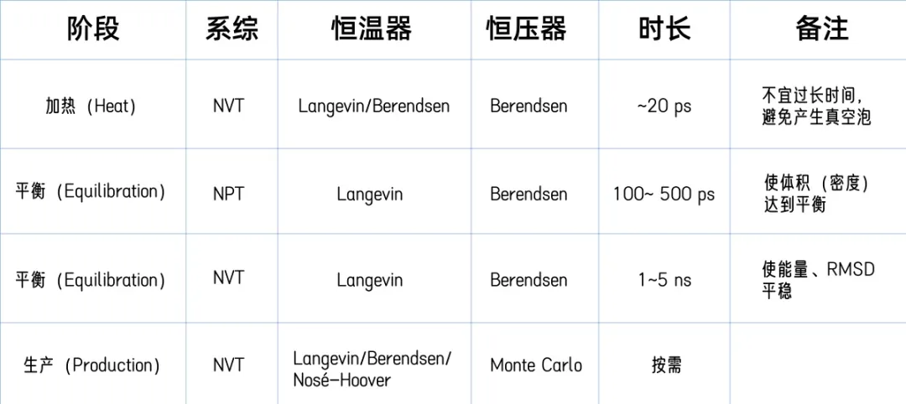
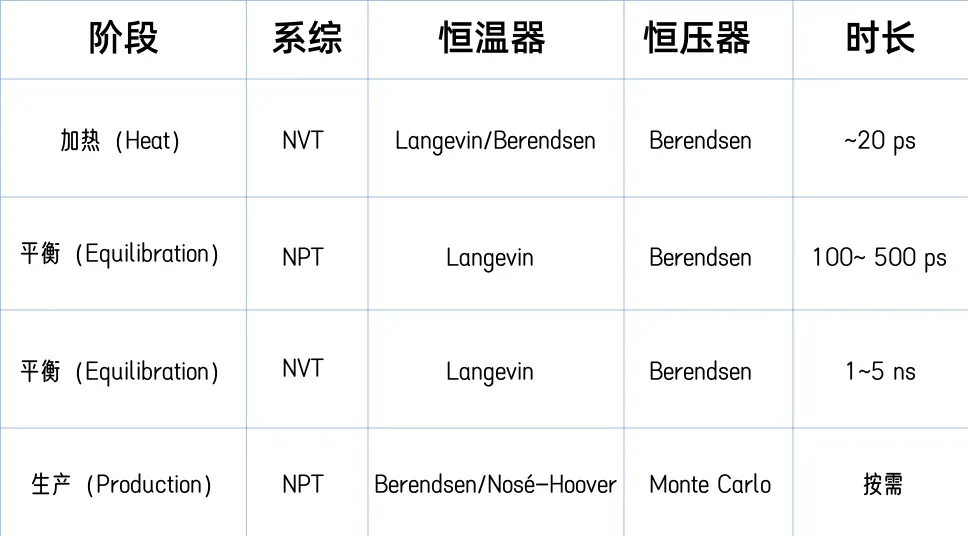
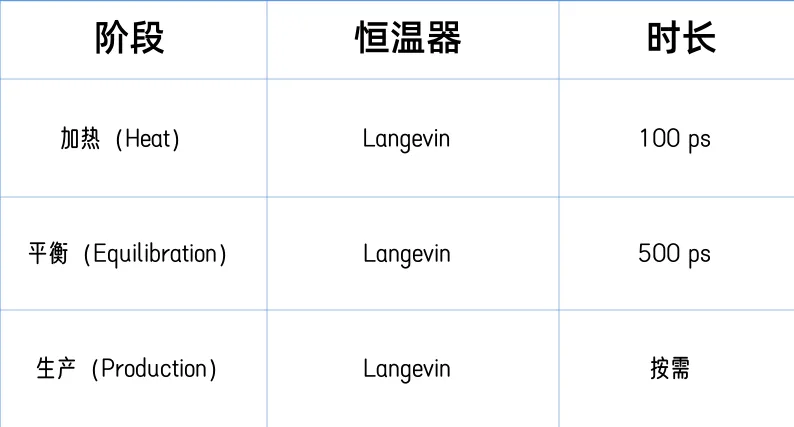
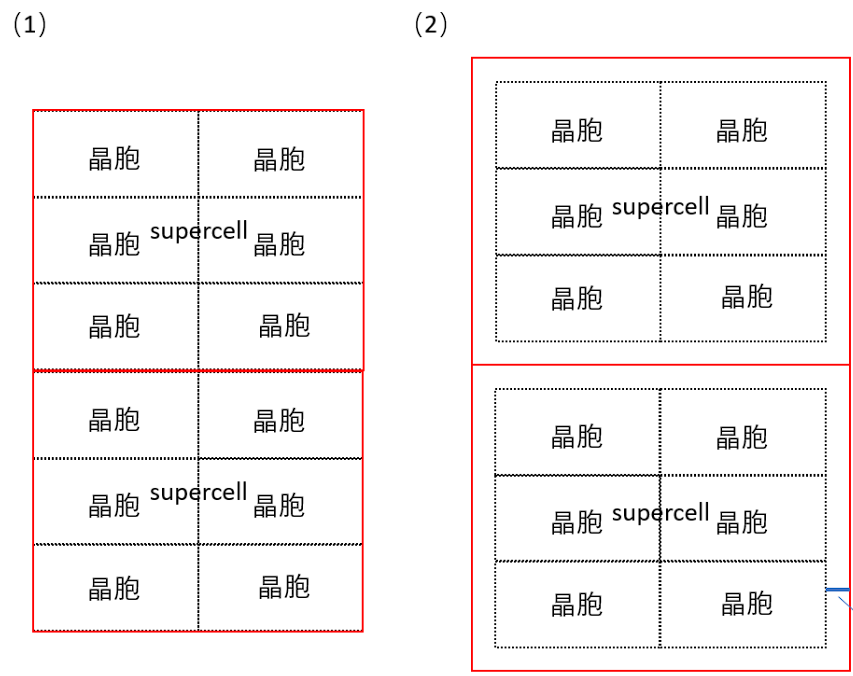

# 模拟参数的设置

分子动力学模需要根据研究目标和系统特性来调整模拟参数。成功的模拟是指那些设置合理且能够实现研究目的的模拟。

## 系综的选择

## 恒温器与恒压器

- 分子模拟中恒温器和恒压器是控制模拟系统温度和压力的工具, 作用是通过调节系统的能量或体积来维持特定的热力学条件，从而确保模拟结果的稳定性和准确性。

### Thermostat

系统的温度与粒子的温度直接相关, 因此恒温器一般通过调整粒子速度来控制温度

1. 速度标度类方法: 不严格遵守正则系综, 适用于加热阶段, 不推荐用于平衡采样
   - 简单速度标度(simple velocity scaling): 不符合玻尔兹曼分布, 可能导致能量突变, 一般不采用
   - Berendsen热浴和Bussi热浴: 弱耦合热浴, 通过与恒温外部热浴耦合来调节系统温度
     - Berendsen热浴适用于加热阶段，但在预平衡阶段不适用，因为它可能导致动能不遵循波尔兹曼分布，从而产生“飞冰块现象”（Flying Ice Cube Effect），即分子振动能减少而平动或转动能增加，使得分子像冻僵的方块一样飞来飞去。这种现象的原因是热浴算法使得分子的振动能量被“砍掉”得多、补充得少，导致分子逐渐“冻僵”，而平动和转动能量受到的影响较小。
     - Bussi热浴作为Berendsen热浴的随机版本，通过从正则分布中随机调整速度来进行温度采样。需要注意的是，Berendsen热浴不适合用于隐式溶剂模拟，因为它无法通过与溶剂的碰撞来维持恒温
2. 随机力或随机速度方法
   - 优点：这类方法能够从正则系综中正确采样，允许使用比NVE（恒体积、恒能量）系综更长的时步，这意味着模拟可以在更大的时间尺度上进行。
   - 缺点：由于引入了随机性，这些方法变得非确定性、非时间反演，这破坏了动量传递，因此不适合用于研究系统的动力学性质，如扩散系数。
   - Langevin热浴和Andersen热浴: 这两种方法的速度和精确度中等，它们通过虚拟随机碰撞来调节速度，虽然干扰了系统的正常演化并削弱粒子间的速度相关性。但它们严格遵循正则系综，不影响各态遍历性，因此适合计算热力学性质，如结合自由能，尤其在隐式溶剂环境下，Langevin热浴能够通过虚拟碰撞补回粘性效应，特别适合使用。
3. 扩展拉格朗日方法: 这类方法克服了上述方法的缺点，可以时间反演，即它们是时间对称的。
   - Nosé-Hoover热浴: 这种方法的算法较为复杂，计算速度较慢。在系统远离平衡态时，温度振荡较大，不易收敛，因此不适用于加热阶段。但它严格产生正则系综热力学，并近似获得真实的动力学，最适合用于平衡采样。
   - Nosé-Hoover热浴在特定体系中可能表现出病态行为，因此发展了一些改进方法，如Optimized Isokinetic Nose-Hoover chain（OIN）和Stochastic Isokinetic Nose-Hoover RESPA integrator

**Amber软件支持Berendsen, Bussi, Langevin, Andersen, Nosé-Hoover热浴**

### Barostat

- Berendsen方法:
  - 特点: 在系统远离平衡态时，该方法对压力的调节效率较高，适用于最初的压力迟豫（即压力的快速调整）。
  - 适用性: 由于它不按照正则分布来采样，一般不适用于平衡采样阶段。
- Nosé-Hoover和Parrinello-Rahman方法
  - 特点：与Berendsen方法相反，这两种方法适用于平衡态控压，能够在平衡状态下维持压力。
  - 适用性：适合在系统达到平衡后使用，以保持恒定的压力。
- 蒙特卡洛（Monte Carlo，MC）方法
  - 特点：方法简单，但效率相对较低。
  - 适用性：该方法适用于采样阶段，尤其是在需要进行压力采样时。

### 搭配示例

1. 研究生物大分子与小分子结合模式，计算结合自由能（热力学性质）
    - 
2. 研究蛋白折叠运动（动力学性质）
    - 
3. 研究水溶液中有机小分子聚集行为，计算回转半径、径向分布函数等
    - 
4. 隐式溶剂环境（GB模型）中研究DNA-小分子的相互作用
    - 

## 盒子尺寸

### 盒子边界的设定

- 一般来说，生物大分子是在液相中模拟的，使用pbc时，要求大分子与盒子边界距离至少大于cutoff的一半，防止与其镜像(邻近像)相互作用
- 盒子中除了目标分子外的其他空间, 要么是真空, 要么被溶剂填充
- 如何模拟的是无限扩展的晶体环境, 原子会扩股盒子边界键合在一起, 则需要盒子边界刚好在晶胞(超胞)的某个面上.
- 

## 模拟崩溃

- [模拟崩溃的原因](http://bbs.keinsci.com/thread-18213-1-1.html)
- 解析gromacs的restraint、constraint和freeze http://sobereva.com/10
