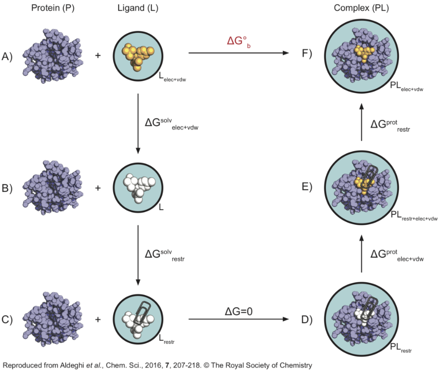
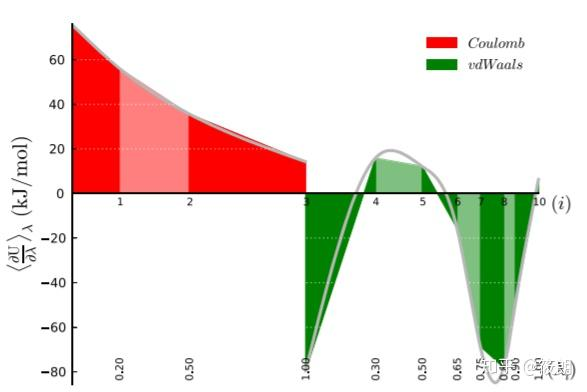
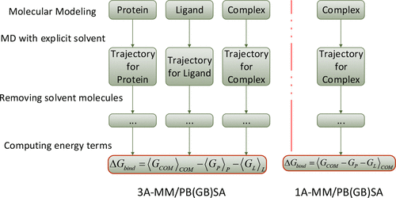
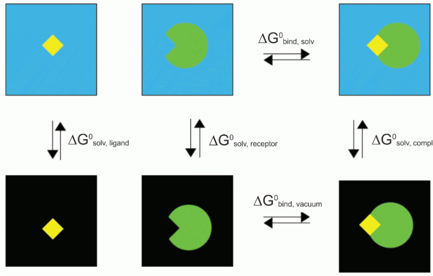

# 自由能的计算

所有物理、化学以及生物过程自发进行达到的程度都是由初态(反应物)与终态(产物)之间的**自由能变化决定的**.

计算自由能的基本思想是研究系统在无限长时间内的能量均值等价于其系综平均值，因而可以通过有限时间的取样来估计系综平均值，进而通过公式求解得到相关自由能数据。

自由能计算本质上是处理考察体系从一个热力学态到另一个热力学态发生的能量变化，这可以指其本身的变化（化合价变化）或者是周围环境的变化（从真空到溶剂，或者是从溶剂到配位环境的变化）

## Alchemical

炼金术自由能（AFE）：使用炼金术（Alchemical）热力学循环, 也被称为**路径方法**, 利用真实世界不存在的状态来计算热力学能，鉴于热力学能是状态函数，不依赖于路径的选取，通过合理地构建热力学态，可以找到一种方便计算的状态途径，而不用考虑它本身是否真实。

虽然原则上可以从一个长的分子动力学轨迹中估计结合的自由能或解离常数，该轨迹对许多关联和解离事件进行采样，这种方法通常是不切实际的，生物体系和溶液中的体系，其柔性很大，直接求算自由能存在很大的困难,在合理的时间尺度上通常是不可能的，会受到计算机时的限制。然而，由于自由能是状态的函数，我们可以自由地选择一条**连接结合态（耦合）和非结合态（解耦）** 的任意路径，即使它是非物理的，并使用某种形式的重要性取样来计算沿这条路径的自由能变化。

分子动力学模拟不是直接模拟实验中小分子与蛋白相结合的真实过程，而是通过建立热力学循环间接计算小分子与靶蛋白的结合自由。在实践中，通常是通过在一系列炼金步骤中扰动哈密顿，逐渐关闭配体和受体之间的相互作用，有效地使配体消失。在随后的步骤中，在溶剂中反转扰动，使配体恢复到完全溶解的环境中，完成热力学循环图（A ---> F）



在这个热力学循环中，黑色圆圈表示需要模拟的系统，回形针表示限制势的存在，白色配体意味着它不与环境相互作用（但仍存在分子内作用），黄色表示显示水溶剂环境。限制势的引入是为了防止配体在蛋白质中乱跑（尤其是关闭了大部分配体与环境的相互作用时）、阻碍收敛，只要最后在能量加上校正项就行。
这个计算将包含两个模拟：配体在水中耦合（或解耦）/配体在蛋白中耦合（或解耦）。看上去我们似乎还需要计算C到D的自由能变化，但实际上C与D的状态是完全相同的，反正此时的配体都不与周围环境有任何相互作用了，换个环境对自由能改变为0。
需要注意的是在关闭相互作用时，我们总是先关闭静电作用，再关闭非静电项；如果反过来的话，那就会出现这样的情况——正负电荷的原子可能会靠的无限近，这显然是不合理的。反之，如果使用的是逐步打开相互作用的途径，那就应该先打开非静电项，再打开静电项。
[Absolute Binding Free Energy - Gromacs 2016 - AlchemistryWiki](https://www.alchemistry.org/wiki/Absolute_Binding_Free_Energy_-_Gromacs_2016)
对每一步进行积分，即可得到总过程的自由能变化，这就是热力学积分计算自由能的方法：





在热力学积分法中，我们计算自由能的方法实际上是使用∂U/∂λ对λ进行积分，λ实际取的是离散值，所以我们得到的自由能实际也是近似值；原则上如果λ无限细分，所得的自由能就可以无限逼近真实值。
[分子动力学中结合自由能的认识-part1 - 哔哩哔哩 (bilibili.com)](https://www.bilibili.com/read/cv14535130/)
[自由能微扰和热力学积分方法  - 计算化学公社 (keinsci.com)](http://bbs.keinsci.com/thread-3331-1-1.html)
[GROMACS中伞型采样算法应用详解 - 计算化学公社 (keinsci.com)](http://bbs.keinsci.com/thread-36490-1-1.html)
[关于自由能，你想了解的一切（一） - 知乎 (zhihu.com)](https://zhuanlan.zhihu.com/p/677507013)
[四种计算自由能方法的原理示例教程|Jerkwin](https://jerkwin.github.io/2017/05/24/%E5%9B%9B%E7%A7%8D%E8%AE%A1%E7%AE%97%E8%87%AA%E7%94%B1%E8%83%BD%E6%96%B9%E6%B3%95%E7%9A%84%E5%8E%9F%E7%90%86%E7%A4%BA%E4%BE%8B%E6%95%99%E7%A8%8B/)
[非平衡采样的自由能计算 - Bohrium (dp.tech)](https://bohrium.dp.tech/notebooks/5725274003)
[自由能专题1：原理及常见方法 - 知乎 (zhihu.com)](https://zhuanlan.zhihu.com/p/365654509)

## 经典的计算方法

**伞形采样, 自由能微扰, 热力学积分**, 这类方法原理上比较严谨, 计算结果也比较精确, 但是需要大量的数据采集, 所需的计算资源很多, 在实际应用上受到体系大小以及计算资源的限制.

### 伞形采样

[Gromacs伞形采样-CSDN博客](https://blog.csdn.net/monkeny/article/details/127760751)
模拟体系访问一个状态的概率，与这个状态的体系总能量E的指数次方成反比，体系绝大部分时间在能量低的构象状态，体系根本无法访问反应坐标上的高能垒部分，导致结果采样不足。Umbrella Sampling可以解决这个问题。

### 自由能微扰（FEP）

Free energy perturbation微扰理论：从一个初始问题开始，称为未扰动问题或参考问题。通常要求这个问题足够简单，可以精确地解决。然后，感兴趣的问题，称为目标问题，表示为参考问题的扰动。扰动的影响可以用关于一个小量的级数展开来表示，称为扰动参数。这个级数可以很快收敛，因此可以在前几项之后截断。进一步期望这些项比精确解更容易计算。
自由能扰动(FEP)：目标系统的哈密顿量表示为参考哈密顿量与扰动项之和（类似于扩展哈密顿方法）。两个系统之间的自由能差精确地表示为参考系统上扰动项适当函数的集合平均。

### 热力学积分（TI）

Thermodynamic intergration

BAR/MBAR

## 生物大分子自由能计算方法

- 自由能微扰（FEP）和热力学积分（TI）**是炼金术自由能计算中广泛使用的两种技术**。然而，炼金术方法的一个关键问题是自由能差的缓慢收敛和高计算成本。在涉及缓慢结构转型或大规模环境重组的系统中，趋同特别困难。
- 在简单体系以及小分子体系中, 由于不受计算效率的限制, 自由能数据的计算方法的选择就比较多, 可以根据研究目的选择准确度高的方法.
- 对于生物大分子体系来说, 由于一般都需要水溶液环境, 研究体系粒子数往往都在几十万以上, 因此生物大分子体系的自由能计算往往面临着计算效率和结果准确度的权衡问题.
- 另一方面，**终点自由能方法**, 基于对系统最终状态的采样，因此，它们比路径方法便宜得多，并且比大多数对接评分函数更准确。最著名的端点自由能方法是分子力学Poisson-Boltzmann表面积（MM/PBSA）和分子力学广义Born表面积（MM/GBSA），由Kollman等人开发，它在计算效率和准确性之间实现了良好的平衡

### MM-PBSA

-  分子力学泊松-玻尔兹曼表面积(Molecular Mechanics Poisson-Boltzmann Surface Area)是一种计算分子间相互作用能的方法，它结合了分子力学模拟、泊松-玻尔兹曼方程和表面积法。对MD轨迹进行后处理以估计结合自由能的方法, 计算时会将溶剂视为均匀的连续介质, 并基于力场和隐式的连续介质模型, 对平衡轨迹中的许多帧进行平均, 以考虑温度的影响. 尽管MM-PBSA方法的准确度不如FEP和TI, 但这种方法的计算量小, 在分子识别, 区分结合的强弱方面是一种有效的方法, 因此在生物分子模拟和药物筛选领域应用广泛, 并已经成功地用于许多结合自由能的计算.
- MM-PBSA（分子力学泊松-玻尔兹曼表面积）方法是一种用于计算分子间结合自由能的计算化学技术。其基本原理是通过结合分子力学（MM）和泊松-玻尔兹曼方程（PB）来估算溶剂化分子在结合和游离状态之间的自由能差异。
- MM/PBSA（分子力学/泊松-玻尔兹曼表面面积）和MM/GBSA（分子力学/广义布伦德尔表面面积）是两种预测大分子结合自由能的流行的方法，**比大多数分子对接的评分函数更准确，并且比炼金术自由能方法计算量更少**。
- MM-PBSA方法与MM/GBSA方法的主要区别在于计算溶剂化自由能（ΔG PB/GB）的方式不同。在MM-PBSA方法中，ΔG PB是通过求解计算量较大的泊松-玻尔兹曼（PB）方程来评估的，而在MM/GBSA方法中，ΔG PB进一步被近似为广义波恩（GB）模型，从而使用更快的方法来推导
- [MM-PBSA](https://ambermd.org/tutorials/advanced/tutorial3/section1.php)存在多种工具和程序（如gmx_MMPBSA和MMPBSA.py）支持MM/PBSA计算





### GROMACS计算相互作用

GROMACS将分子间的相互作用主要分为范德华相互作用和库伦相互作用；范德华力主要可以分为短程的Lenard-Jones potential(LJ)以及长程的色散相互作用；库伦相互作用则分为短程的库伦相互作用和长程的库伦相互作用。
在 `gmx energy` 给出的选项中，参数LJ(SR)表示短程LJ势能，Disper.corr.表示分子间作用力的色散项，Coulomb(SR)表示短程库伦相互作用，Coul.recip. 表示倒易空间的长程的库伦相互作用。本文抽提上述四种能量数据，另外计算总能量ETOTAL和库伦相互作用COULOMB，ETOTAL加和了上述四种能量，也即所有的范德华相互作用和库伦相互作用，而COULOMB则加和了Coulomb(SR)和Coul.recip，表示总的库伦相互作用。而被用于表征蛋白质和配体间的相互作用则主要是LJ(SR)、Coulomb(SR)以及ETOTAL。
LJ以及库伦相互作用的短程和长程的截断值在 md.mdp文件中都被设置。范德华力随分子距离的增加衰减很快，所以短程的LJ势能占据了蛋白质和配体范德华作用的绝大部分，并且常被用作疏水相互作用的一种表征。而库伦相互作用则一般认为是长程相互作用，且由于主体模拟中采用PME方法处理库伦作用，故而这里需要将短程库伦相互作用和倒易空间长程库伦相互作用加和才是最终的库伦相互作用。

GROMACS不像Amber那样自带 `MM/PBSA.py`结合自由能计算程序

[Gromacs结合自由能计算教程（一） - 知乎 (zhihu.com)](https://zhuanlan.zhihu.com/p/60963446)
[Gromacs结合自由能计算教程（二） - 知乎 (zhihu.com)](https://zhuanlan.zhihu.com/p/61763387)
[Gromacs结合自由能计算教程（三） - 知乎 (zhihu.com)](https://zhuanlan.zhihu.com/p/62399118)
[GROMACS教程：使用GROMACS计算MM-PBSA结合自由能|Jerkwin](https://jerkwin.github.io/GMX/GMXtut-9/#:~:text=%E5%9C%A8%E5%88%86%E5%AD%90%E6%A8%A1%E6%8B%9F%E9%A2%86%E5%9F%9F,%20%E5%87%86%E7%A1%AE%E8%AE%A1%E7%AE%97%E7%BB%93%E5%90%88%E8%87%AA%E7%94%B1%E8%83%BD(binding))

### gmx_MMPBSA

- 在使用 `gmx_MMPBSA`程序进行MM/PBSA结合自由能计算之前，需要准备好以下文件：
  - an input parameters file (`*.in`, contains all the specifications regarding the type of calculation that is going to be performed)
  - a MD Structure+mass(db) file (`*.tpr`, `*.pdb`)
  - an index file (`*.ndx`)
  - receptor and ligand groups (group numbers in the index file)
  - a trajectory file (`*.xtc`, `*.pdb`, `*.trr`)
  - In certain occasions, defining a topology file (`*.top`) may be required.
- 前处理：经过长时间的动力学模拟，体系很容易出现由PBC引起的问题，包括：跨周期漂移、亚单元分离。这时需要先对轨迹文件做适当处理。

```sh
gmx trjconv -f CMC1MD0.xtc -s CMC1MD0.tpr -o CMC1.xtc -n CMC1.ndx -pbc mol -center -ur compact
```

- MMPBSA计算还需要准备一个参数文件（Input parameters file）`mmpbsa.in`

```mmpbsa.in
# General namelist variables
&general
  sys_name             = ""                      # System name
  startframe           = 1                        # First frame to analyze
  endframe             = 500                     # Last frame to analyze
  forcefields          =                         # 有拓扑文件可以不写
  temperature          = 298.15                                         # Temperature
/

# (AMBER) Possion-Boltzmann namelist variables
&pb
  istrng        = 0.15
  npbopt        = 0

```

- 运行命令：

```sh
# 生成参数文件模板
gmx_MMPBSA --create_input args
where `args` can be:  gb, gbnsr6, pb, rism, ala, decomp, nmode, all

# 串行计算
gmx_MMPBSA -O -i mmpbsa.in -cs CMC1MD0.tpr -cp CMC1.top -ci CMC1.ndx -cg 1 9 -ct CMC1.xtc -o freeenergy.dat -do decomp.csv -nogui && gmx_MMPBSA --clean
# 并行计算
mpirun -np 2 gmx_MMPBSA MPI -O -i mmpbsa.in -cs CMC1MD0.tpr -cp CMC1.top -ci CMC1.ndx -cg 1 9 -ct CMC1.xtc -o FINAL_RESULTS_MMPBSA.dat -eo FINAL_RESULTS_MMPBSA.csv
-np 使用CPU数
```

[The input file - gmx_MMPBSA Documentation](https://valdes-tresanco-ms.github.io/gmx_MMPBSA/dev/input_file/)
[gmx_MMPBSA输入参数含义 - 知乎](https://zhuanlan.zhihu.com/p/500166780)
[使用gmxMMPBSA进行计算时轨迹文件的帧数是否会影响计算结果？ - 分子模拟 (Molecular Modeling) - 计算化学公社](http://ccc.keinsci.com/thread-46885-1-1.html)
帧数选择：[计算MMPBSA，帧数如何选择 - 计算化学公社](http://bbs.keinsci.com/forum.php?mod=viewthread&tid=31442&highlight=MMPBSA)
[自由能专题1：原理及常见方法 - 知乎](https://zhuanlan.zhihu.com/p/365654509)
T▲S构象熵：如果只需要比较分子之间结合自由能的相对大小，那么受体和配体的构象能变化的计算可以忽略。对于部分体系，如果研究的分子具有较大的结构差别，而且在配体和受体的结合过程中，配体或 （和）受体的构象变化较大，就需要对构象能的变化进行考虑。

官网：[Home - gmx_MMPBSA Documentation](https://valdes-tresanco-ms.github.io/gmx_MMPBSA/dev/)
[GROMACS分子动力学的MM/PBSA结合自由能计算教程](https://mp.weixin.qq.com/s?__biz=MzI5MDIyNDg1Mg==&mid=2247489552&idx=1&sn=67bb62f56178838b760ceaea5fa09c81&chksm=ec2277abdb55febd96cbbea794183664f75f5577e42f18d41744af73983cd22ed8184f7679ff&scene=27)
[gmx_mmpbsa 安装+使用教程 - 知乎](https://zhuanlan.zhihu.com/p/528893992)

- 计算结果展示

```sh
gmx_MMPBSA_ana -f ./
```
