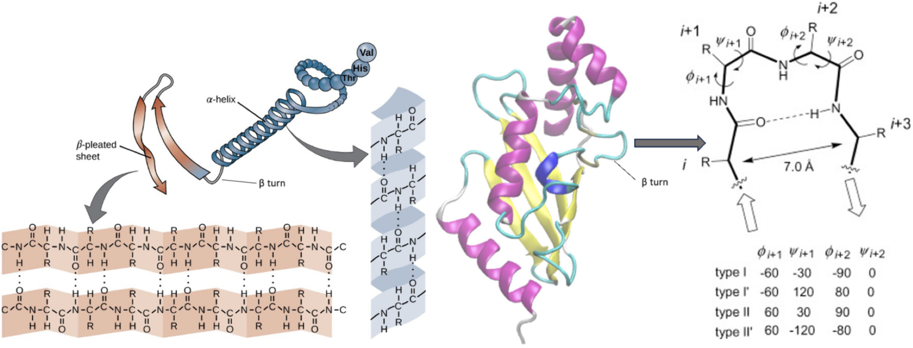
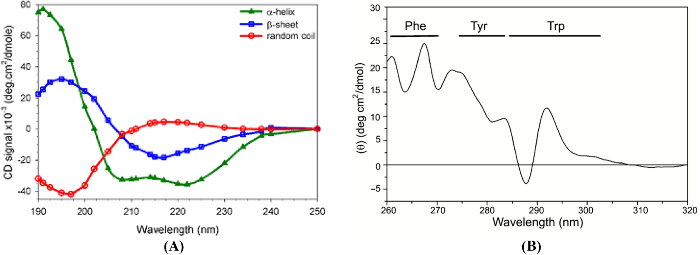

# 蛋白质二级结构

## 分类

- 一般统计只考虑最常见和重要的二级结构
- **α-螺旋**（Alpha Helix）: 约30%
- **β-折叠**（Beta Sheet）: 约60%
  - 分为平行β-折叠(parallel)和反平行β-折叠(antiparallel), 反平行通常比平行更稳定, 其氢键排列更加规则
  - 包括β-链/股（β strand）和β-转角（β Turn）
    - β Sheet由 β strand (β链)平行排列而成, 2到12个氨基酸
    - **β-转角**（Beta Turn）连接两个β sheet片段, 四肽
    - β-桥(β bridge): 相邻的β-股通过氢键连接形成
- bend: 弯曲区域, 比例较低
- **无规卷曲**（Random Coil）
- 其他特殊结构, 较为少见, 通常出现在特定的蛋白质中

## 计算二级结构的方法

> 定义: 氨基酸链盘旋或折叠形成的有规则的构象

- 二级结构是指多肽骨架通过氢键形成的高度规则的局部亚结构。(特别是，羰基氧原子与酰胺氢形成氢键)
- 
- 主要通过氢键来维持稳定性
- 二级结构是蛋白质折叠的中间水平，介于一级结构（氨基酸序列）和三级结构（总体3D形状）之间。在决定蛋白质的最终功能构象和稳定性方面起着至关重要的作用。
- 二级结构的两种主要类型是α-螺旋和β-链（可以形成β-折叠）。
- [Introduction to Organic and Biochemistry (Malik): 7.4 Secondary structure of proteins](https://chem.libretexts.org/Bookshelves/Introductory_Chemistry/Introduction_to_Organic_and_Biochemistry_%28Malik%29/07:_Proteins/7.04:_Secondary_structure_of_proteins)
- 详细的根据不同的分类标准，蛋白质的二级结构可以分为以下几种类型

### DSSP分类法

*介绍*

- DSSP（Dictionary of Secondary Structure in Proteins）: Assign secondary structure to proteins
- DSSP 程序由 Wolfgang Kabsch 和 Chris Sander 设计
- 是一种基于原子坐标的二级结构解析算法, 它不能预测二级结构, 而是解析二级结构.
- 官网: [DSSP](https://swift.cmbi.umcn.nl/gv/dssp/)

*获取*

- 在[&gt;&gt;这里&lt;&lt;](https://pdb-redo.eu/dssp)可以使用在线webserve
- 也可以[下载](https://pdb-redo.eu/dssp/download)到本地安装使用
- 在一些Linux发行版(Debian 和 Ubuntu)可以使用 apt 命令安装
- 也可以在[conda](https://anaconda.org/sbl/dssp)中安装使用
- 在GROMACS中使用
  - 旧版本的 `gmx do_dssp`需要借助外部dssp程序, 并设置一个指向dssp可执行文件的环境变量DSSP
  - 新版的 `gmx dssp`是GROMACS内置的工具, 不需要额外安装dssp

*分类*

- DSSP 提供了二级结构元素的详细描述，包括骨架氢键和β-折叠的拓扑结构, 用单个字符代码对每个残基所属的二级结构进行分配
- DSSP 定义了8种二级结构:
  - H = α-helix（α-螺旋）
  - B = residue in isolated β-bridge (β-桥)
  - E = extended strand, participates in β ladder
  - G = $3_{10}$-helix（$3_{10}$-螺旋）
  - I = π-helix（π-螺旋）
  - P = κ-helix (poly-proline II helix) (κ-螺旋)
  - T = hydrogen-bonded turn (氢键转角)
  - S = bend（卷曲）
- GROMACS 内置dssp工具的10种二级结构:
  - H — alpha-helix;
  - B = residue in isolated beta-bridge;
  - E = extended strand that participates in beta-ladder;
  - G = $3_{10}$-helix;
  - I = pi-helix;
  - P = kappa-helix (poly-proline II helix);
  - S = bend;
  - T = hydrogen-bonded turn;
  - = = break;
  - ~ = loop (no special secondary structure designation).

### 拓展阅读

- [DSSP document format](https://pdb-redo.eu/dssp/about)
- [GitHub: PDB-REDO/dssp](https://github.com/PDB-REDO/dssp)
- [DSSP计算蛋白质二级结构 - 知乎](https://zhuanlan.zhihu.com/p/380242442)
- [分子模拟||DSSP分析蛋白质二级结构 - 知乎](https://zhuanlan.zhihu.com/p/403287019#)
- [深入了解蛋白质二级结构无规则卷曲与环 - 简书](https://www.jianshu.com/p/0844c02fc550)

## 测定二级结构的方法

- 普通实验手段通常只能解析常见的特征性明显的二级结构类型, 如α-螺旋和β-折叠含量, 而无法提供详细的结构细节.
- 实验数据需要配合解析软件才能获取二级结构含量数据
- **一般能解析出四种二级结构含量**: α-螺旋, β-折叠, β-转角, 无规卷曲
- 此外, 还能通过X射线晶体学解析蛋白质的三维结构，再根据结构计算二级结构.

### 圆二色光谱法

- 圆二色性（CD）光谱是用于测量光学活性物质中的左右圆偏振光的吸收差异的技术。
- CD信号可以在具有光学活性（手性）材料中被检测到, 同时手性也可以通过与手性发色团共价键合或将发色团置于不对称环境中来产生。
  - 蛋白质分子对左旋和右旋圆偏振光吸收差异, 推断二级结构
  - 由于分子的手性, 对不同波长下左旋和右旋圆偏振光的吸收有差异
  - 二级结构由于氢键和空间排列的不同，表现出特定的圆二色性特征峰：
    - α-螺旋：在208 nm和222 nm处出现负峰，在222 nm处摩尔椭圆度较大
    - β-折叠：在217 nm处出现负峰
    - 无规卷曲：在195 nm左右出现负峰
- 圆二色谱常用于蛋白质构象、生物分子的结构研究和手性鉴别。
- 圆二色性（CD）的生物分子结构分析方法需要仔细考虑几个关键因素: 溶剂，缓冲溶液，样品浓度，光程长度，仪器参数(如扫描速度，重复次数和氮气流速)
  - 光谱范围: 远紫外CD光谱（190-250 nm）提供了有关肽骨架构象和二级结构含量的信息。近紫外CD光谱（250-350 nm）可以深入了解芳香族氨基酸残基的三级结构和环境。
  - 溶剂应在远紫外区（低于250 nm）透明, 保持蛋白质的天然或所需构象, 保持高纯度和脱气处理可以减少散射和信号噪音, pH和离子强度应与蛋白质的稳定性和所需构象相容(磷酸盐、乙酸盐和tris等缓冲液通常用于维持所需的pH值和离子环境).
- CD属于光的吸收现象，其原理基于比尔定律: $A=εlc$
  - 其中A表示吸光度，ε是摩尔吸光系数常数，l是光程，c是浓度
  - 为了适应吸光度限制，可以调整样品浓度和池(cell)路径长度。
  - CD测量的最佳浓度范围对于远UV区域（250-190 nm）的肽通常为0.1 mg/ml，对于（350-250 nm）的肽通常为1 mg/ml
  - 较高的浓度可能导致过度吸收，导致光谱失真或信号丢失。
  - 较低的浓度可能会导致较差的信噪比。
- 扫描速度: 生物样品的典型扫描速度范围为20至100 nm/min。对于大多数蛋白质和核酸样品，良好的起始点约为50 nm/min。
- 氮气流速: 对于CD仪器，氮气流速通常设置为约10 L/min（升/分钟）。建议采用这种高流速，以便有效地清除仪器光学器件和样品室中的氧气。
- 检测器的电压, 信号的积分方式, 多次扫描或测量进行平均以提高所获取的CD光谱的信噪比（S/N）也会影响信号的质量
- 数据的处理: 基线校正, 平滑
- 平均残基椭圆率(mean residual ellipticity)的换算:
  - 对于蛋白质二级结构分析，CD信号通常通过对蛋白质浓度、光程长度和氨基酸残基数目进行归一化来转换为平均残基椭圆率（[θ]MR）。换算公式为：[θ]MR =（θ × M）/（10 × c × l × n）
  - 其中θ为椭圆率（单位：mdeg），M为分子量，c为浓度（单位：mg/mL），l为路径长度（单位：cm），n为残基数。
- 圆二色性的表示方式
  - 吸光系数差值（Δε）: Δε是左旋圆偏振光和右旋圆偏振光的摩尔吸光系数之差（Δε = εL - εR）单位通常为 M⁻¹cm⁻¹ 。这种表示方式直接反映了手性物质对左旋和右旋圆偏振光的吸收差异。
  - 椭圆率（θ）是描述样品光学活性的重要参数，通常通过圆二色性光谱（CD光谱）测量得到, 定义为左旋和右旋圆偏振光的消光系数之差（Δε）与左旋消光系数（εL）的比值: $θ=\frac{Δε}{εL}$
  - 摩尔椭圆率, Molar ellipticity（θ）是椭圆率与摩尔浓度（c）的乘积: $[θ]=deg.cm^2.d.mol^{-1}$, 摩尔椭圆率则进一步考虑了样品的浓度，使其能够反映单位摩尔样品的光学活性.
  - 根据Lambert-Beer 定律可证明椭圆率近似地为：$θ= 0.576 lc(εl - εd) = 0.576 lcΔε$
  - 毫度, mdeg
  - 毫度和平均残基椭圆率两者之间可以根据 Beer-Lambert law 公式进行换算: `mdeg = [θ].l.c`, 其中 l 为平面光光程（mm）、c为待测样品的浓度（mM）
  - **实际测试中得到的左、右偏振光吸收系数之差一般都是以毫度表示**, 把实验中测定得到的mdeg值乘以1000除以光程(mm)再除以浓度(mM) 所得的值的即为molar ellipticity [θ]（单位deg.cm2.dmol-1）
  - 对于蛋白质来说文献中通常都使用平均残基椭圆率 mean residue ellipticity [θ]
  - 由于mean residue molecular weight= protein formula weight/number of residues，故最后还应把通过上述方法计算出的数值再除以蛋白质残基数。
- CD数据解析: 远紫外CD光谱（190-250 nm）提供了有关肽骨架构象和二级结构含量的信息。在这些波长下的发色团是肽键，当它处于规则的折叠环境中时会产生信号。
  - 肽发色团的最弱能量跃迁是n→π* 跃迁，其发生在210-220 nm处, 涉及来自羰基的O的非键合电子
  - 羰基的π电子的π→π* 跃迁是最强的能量吸收带, 以190 nm为中心
  - α-螺旋、β-折叠和无规卷曲结构都产生CD光谱的独特形状和幅度。
    - 无规卷曲的远紫外CD在212 nm（n→π*）处为正，在195 nm（π→π*）处为负。
    - β折叠的远紫外CD在218 nm处为负（π→π*），在196 nm处为正（π→π*），导致V形光谱
    - α螺旋的 π→π* 跃迁的激子耦合(Exciton coupling)导致在192 nm处为正，在208 nm处为负，并且在222 nm处红移为负，导致了α螺旋的特征W形光谱
    - 
    - β转折CD谱在225 nm附近有一个弱的负带（n → π* 跃迁），在200 nm附近有一个较强的正带（π → π* 跃迁），在190 nm以下有一个负带
- 近紫外CD光谱（250-320 nm）可以提供对芳香族氨基酸残基的三级结构和环境的深入了解。在这些波长下的发色团是芳香族氨基酸和二硫键，它们产生的CD信号取决于蛋白质的整体三级结构。
  - 255至270 nm的信号归属于苯丙氨酸残基的苯基，275至285 nm的信号归属于酪氨酸的酚基，285至305 nm的信号归属于色氨酸的吲哚基。(见上图B)
  - 二硫键在近紫外光谱上提供宽而弱的信号，没有电子振动结构。
  - 近紫外圆二色谱可检测到蛋白质-蛋白质相互作用或溶剂条件产生的三级结构的适度变化。
  - 在近UV CD区域中的信号强度远低于在远UV CD区域中的信号强度, 因此需要更高的样品浓度(约1 mg/ml的肽)

**CD衍生的二级结构应通过与其他结构技术（如X射线晶体学、NMR或分子动力学模拟（如果可用））进行比较来验证。**

> 除了仪器提供的软件外，还有几种其他工具和软件包可用于分析圆二色性（CD）数据，以估计蛋白质的二级结构含量。

#### CDNN

- 一些测试公司在用的软件, 帮你解析一个样品居然还额外收费!

#### DichroWeb在线服务器

- [DichroWeb: On-line analysis for protein Circular Dichroism spectra](http://dichroweb.cryst.bbk.ac.uk/html/home.shtml)
- 提供对SELCON3、CDSSTR和其他分析程序的在线访问。

#### CDPro

- [CDPro – Programs to Analyze Protein CD Spectra](https://www.bmb.colostate.edu/cdpro/)
- 包括SELCON3、CDSSTR和CONTIN等程序，用于分析蛋白质CD光谱，以确定二级结构组分（α-螺旋、β-折叠、转角等）
- SELCON3 uses the self-consistent method, while CDSSTR and CONTIN employ ridge regression and convex constraint algorithms, respectively
- 离线版本的DichroWeb服务器，允许本地分析CD数据

#### DicroProt suite

- 包含较旧版本的程序，如VARSLC、SELCON2、SELCON3、CONTIN和K2D

#### SOMCD

- 基于K2 D算法的在线工具，除了分析α-螺旋和β-折叠内容外，还分析转弯。

#### CDtoolX

- 论文: [CDtoolX, a downloadable software package for processing and analyses of circular dichroism spectroscopic data](https://onlinelibrary.wiley.com/doi/10.1002/pro.3474)

#### 拓展阅读

- [圆二色谱 (Circular Dichroism) 单位转换方法](https://iscms.westlake.edu.cn/info/1052/1435.htm)\
- [An introduction to circular dichroism spectroscopy](https://people.bath.ac.uk/gp304/cd/manuals/CD%20spectroscopy.pdf)
- [Proteins, Structure and Methods: Circular dichroism (CD)](http://bio-structure.com/methods-of-structural-studies/spectroscopy/cd)
- [文献综述: 用圆二色光谱仪测定多肽和蛋白质二级结构和三级结构的综合指南](https://onlinelibrary.wiley.com/doi/10.1002/psc.3648)
- [日本分光 JASCO: Theory of Circular Dichroism Spectroscopy](https://jascoinc.com/learning-center/theory/spectroscopy/circular-dichroism-spectroscopy/)
- [美国国家癌症研究所: Sample Preparation for CD Measurements](https://ccr.cancer.gov/sites/default/files/cd_sample_preparation-508.pdf)
- [CD解谱工具下载](https://people.bath.ac.uk/gp304/cd/manuals/CD_DECONVOLUTION.zip)

### 傅里叶红外光谱法

- 蛋白质分子的红外吸收光谱能够提供氢键和肽键的信息, 从而推断二级结构.
- 利用**Peakfit工具**可以对红外光谱进行分峰处理, 然后计算二级结构含量.

### 核磁共振法

- 通过比较Cα和Cβ化学位移的差异, 可以区分α-螺旋和β-折叠

## 预测二级结构

预测蛋白质二级结构的方法主要分为基于序列分析、机器学习和结合结构信息三大类.